```{julia}
#| echo: false
using CairoMakie, AlgebraOfGraphics, SwarmMakie
using DataFrames, DataFramesMeta
using GLM, MixedModels, Distributions
using LinearAlgebra, Random, StatsBase

# Global theme settings
set_theme!(Theme(
    fontsize = 18,
    font = "Helvetica",
))

# Helper: make swarm (beeswarm) points along x-axis
function swarm_along_x!(ax, x; y_pos=-1, swarm_width=0.5)
    xs = similar(x)
    for i in eachindex(x)
        xs[i] = x[i] + (rand() - 0.5) * swarm_width
    end
    scatter!(ax, xs, fill(y_pos, length(xs)), markersize=6, alpha=0.7)
    return ax
end

# More Reveal options in the bottom
```

```{julia}
#| echo: false
# Custom plot helpers
function make_fig(figsize=(600, 400))
    Figure(size=figsize)
end
```


## Slides & my Presentation style


<a href="?showNotes=true">Click this link to add notes to the slides</a>

<small>
this adds  `?showNotes=true` to the file
</small>


You can download the pdf or print them yourself:

<a href="?print-pdf"> click this link for pdf printable (use google chrome)</a>

<a href="?print-pdf&showNotes=true"> click this link for pdf printable + notes</a>


HTML is best viewed in chrome

<aside class="notes">
I don't like words on my slides. If you prefer to read instead of listen, I recommend several books at the end of the lecture.

The webpage is best viewed in google chrome, you can also simply download the pdfs. There will be two versions, one with and one without notes. but if you are reading this text, you already found the notes ;-)
</aside>

## Overview next days


# Purpose of Statistics

## Purpose of statistics

- Organization

 </img>

- Description

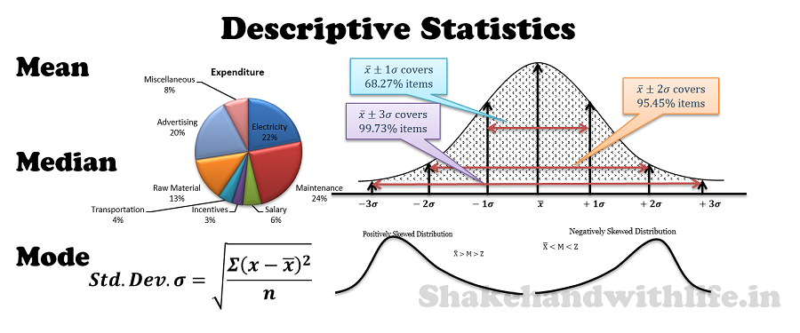 </img>

- Inference

<aside class="notes">
**Organization** means that you get structure in how you look at your data. One word of advice, look up the "tidy dataframe". For many datasets this is the way to go: each variable gets one column, each observation gets one row - nice and easy.

**Description**
Descriptive statistics are all kind of means, variances, plots ... that you can make of your data sample.

**Inference**
As soon as you want to infer from your sample to your population (later more) you need inference statistics.

</aside>


## Why statistics in the first place?

**Because of Variation**


<small>[source-youtube-video of image](https://www.youtube.com/watch?v=y3A0lUkpAko)</small>
<aside class="notes">
There are many answers, variation is just one motivation.
- natural : The variation that is natural to the sample, e.g. apples have a distribution of redness, not a single value
  - sampling error: The variation we get when we take a subset of a population. I.e. two baskets of red apples have different sample distributions of redness
  - explainable: The variation we can explain by e.g. knowing which apple belongs to which variety of apples
  - non-sampling error: The variation we get e.g. non-randomly samplig apple trees (get all apples from one tree, but the orchard is actually mixed variety - we are missing out on other trees)


"The idea of an infinite population distributed in a frequency distribution in respect of one or more characters is fundamental to all statistical work. From a limited experience., we may obtain some idea of the infinite hypothetical population from which our sample is drawn, and so of the probable nature of future samples to which our conclusions are to be applied. If a second sample belies this expectation we infer that it is. drawn from a different population; that the treatment to which the second sample. had been exposed did in fact make a material difference, or. had materially altered. Critical tests of this kind may be called tests of significance, and when such tests are available we may discover whether a second sample is or is not significantly different from the first" (Fisher, 19542, p.41).
</aside>


## Most important lesson
**Always visualize your data**

> ...make both calculations and graphs. Both sorts of output should be studied; each will contribute to understanding.
F. J. Anscombe, 1973

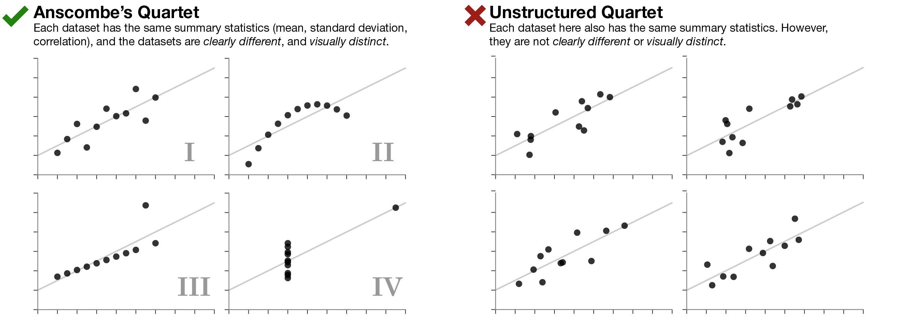
<aside class="notes">
The point here is, that only looking at results of tests, means etc. can never show the whole story. The first thing I do when someone asks me to help them with their statistics, I look at their data!
</aside>

---

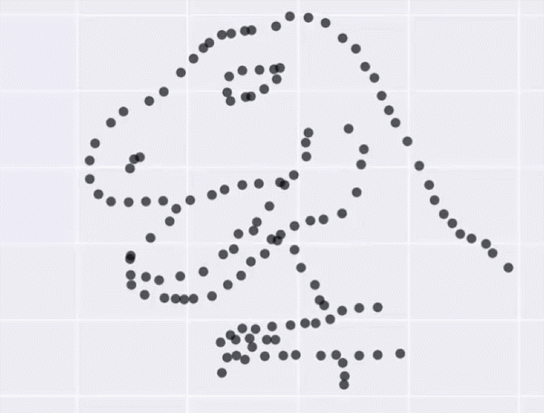

These data all have the same mean + variance + correlation!
<aside class="notes">
How to do this plot: [Justin Matejka, George Fitzmaurice](https://www.autodeskresearch.com/publications/samestats)
</aside>
#


## Button Pressing Experiment

```{julia}
using Random, DataFrames,StatsBase
Random.seed!(1)
n_trials = 100

d = DataFrame(
    round_square = repeat(["round","square"],inner  = Int(n_trials / 2)) 
)
d.button_size = repeat(1:10,inner=Int(n_trials/10))
d.button_size[d.round_square .== "square"] .+= 5
#d.button_size = clamp(d.button_size,10)

d.reactiontime = Int.(d.round_square .=="square").*-50 .+ log.(d.button_size).*100 + rand(100)*100

d_mean = combine(groupby(d,:round_square),:reactiontime => mean => :reactiontime)
```

```{julia}
#| echo: true
#| fig-height: 2

data(d) * mapping(:round_square,:reactiontime) * visual(Scatter) |> draw
data(d_mean) * mapping(:round_square,:reactiontime) * visual(Scatter,color=:red) |> x->draw!(current_axis(),x)

current_figure()
```
<aside class="notes">
In a simple reaction time experiment we ask subjects to click on rounded or square buttons on computer screen. 
</aside>

## There could be confounds!
```{julia}
#| echo: true


data(d) * mapping(:round_square,:reactiontime,color=:button_size) * visual(Scatter) |> draw

f
```

<aside class="notes">
Uhoh, button size was not controlled for, this might lead to problems in your conclusion!

</aside>
## Preview: Multiple regression to the rescue
$reactiontime = Average + isRound + buttonSize$


$reactiontime = \beta_{average} + \beta_1 \cdot isRound + \beta_2 \cdot buttonSize$

> - Linear Models allow to structure and separate effects
<br>
> - Linear Models allow to predict values (e.g. what if button-size would be double the size?)
<br>
> - Linear Models can be easily extended for non-linear effects (e.g. GAM), complicated distributions(e.g. Yes/No aka logistic regression) or multiple outcomes (General Linear Model)

<aside class="notes">
Linear regression allows one to model multiple influences at the same time. We structure our problem and try to disentangle influences.  This slide is used as a motivation and the concepts will be explained on the next slides.
</aside>

# New Section


## The simple linear regression
```{julia}
#| echo: false
fit = lm(@formula(reactiontime ~ 1 + round_square), d)

f = Figure(size=(600, 400))
ax = Axis(f[1,1], xlabel="round or square?", ylabel="DriversKilled")
scatter!(ax, d.round_square .== "square", data.DriversKilled)
# Add regression line
kms_range = range(minimum(data.kms), maximum(d.kms), length=100)
pred_y = predict(fit, DataFrame(kms=kms_range))
lines!(ax, kms_range ./ 1000, pred_y, color=:blue, linewidth=2)
f
```
```{julia}
#| echo: true
#| eval: false
fit = lm(@formula(DriversKilled ~ 1 + kms), data)
```

<aside class="notes">
The `lm` function is extremely important. Helpful other functions that work nicely are: `predict`, `confint`, `residuals`
</aside>

## Lines are simple! Intercept + Slope

```{julia}
annotate_y = predict(fit, DataFrame(kms=[10000, 20000]))

f = Figure(size=(600, 400))
ax = Axis(f[1,1], xlabel="kms/1000", ylabel="DriversKilled")
scatter!(ax, data.kms ./ 1000, d.DriversKilled)
kms_range = range(minimum(d.kms), maximum(data.kms), length=100)
pred_y = predict(fit, DataFrame(kms=kms_range))
lines!(ax, kms_range ./ 1000, pred_y, color=:blue, linewidth=2)
# Annotate segments
lines!(ax, [10, 10], [annotate_y[1], annotate_y[2]], color=:red, linewidth=2)
lines!(ax, [10, 20], [annotate_y[2], annotate_y[2]], color=:green, linewidth=2)
f
```

$$ DriversKilled = \beta_0 + (kms/1000) * \beta_1 $$
<br>
<span style="color:red"> Red Line</span>: $[DriversKilled | kms/1000==20] - [DriversKilled | kms/1000==10]$


$=\beta_0 + 20\beta_1 - (\beta_0 + 10\beta_1)$
$=10\beta_1$


<aside class="notes">
What do the parameters mean? $\beta_0$ is called the Intercept. It reflects the value of DriversKilled when $\beta_1$ is 0. $\beta_1$ reflects the increase in DriversKilled per 1000-km driven.
</aside>

## Which line to choose?
```{julia}
fit = lm(@formula(DriversKilled ~ kms), data)
sigma_cov = cov(params(fit))
# Sample from multivariate normal for uncertain coefficients
Random.seed!(1)
dist = MvNormal(coef(fit), sigma_cov)
uncertain = rand(dist, 200)
# select only some extremes
ix = sortperm(uncertain[1, :])
uncertain_sel = uncertain[:, ix[1:10:end]]

kmpred = range(8000, 21000, step=2)
simdat = DataFrame()
for k in 1:size(uncertain_sel, 2)
    ypred = uncertain_sel[1, k] .+ uncertain_sel[2, k] .* kmpred
    simdat = vcat(simdat, DataFrame(DriversKilled=ypred, kms=repeat([kmpred], 1), group=fill(k, length(kmpred))))
end

f = Figure(size=(600, 400))
ax = Axis(f[1,1], xlabel="kms/1000", ylabel="DriversKilled")
scatter!(ax, d.kms ./ 1000, d.DriversKilled)
kms_range = range(minimum(d.kms), maximum(d.kms), length=100)
lines!(ax, kms_range ./ 1000, predict(fit, DataFrame(kms=kms_range)), color=:blue, linewidth=2)
for g in unique(simdat.group)
    subset = filter(r -> r.group == g, simdat)
    lines!(ax, subset.kms ./ 1000, subset.DriversKilled, alpha=0.2)
end
f
```
<aside class="notes">
Here we show several possible lines, all could fit the data "kind of good". The question is, how to find the best one? Is there a single best one? Or maybe its even better to describe a whole distribution of bestfitting lines.
</aside>

## Residuals / L2 Norm

```{julia}
Random.seed!(2)
corrCoef = 0.5
Σ = [1 corrCoef; corrCoef 2]
dist2d = MvNormal([0.0, 0.0], Σ)
dat_matrix = rand(dist2d, 10)
dat_matrix .= dat_matrix .- mean(dat_matrix, dims=2)
dat = DataFrame(x1=dat_matrix[1,:], x2=dat_matrix[2,:])

# PCA via SVD
svd_result = svd(Matrix(dat)')
v = svd_result.V
x1x2cor = v[2,1] / v[1,1]

fit_2d = lm(@formula(x2 ~ x1), dat)
slope_val = coef(fit_2d)[2]

# Point on regression line
pointOnLine(inp) = begin
    x0, y0 = inp[1], inp[2]
    a = x1x2cor
    b = -(1/a)
    d = y0 - b*x0
    x_int = d / (a - b)
    y_int = -(1/a)*x_int + d
    return [x_int, y_int]
end
points = [pointOnLine(dat[i, :]) for i in 1:nrow(dat)]

f = Figure(size=(800, 400))

# Left: regression
ax1 = Axis(f[1,1], title="regression", xlabel="", ylabel="")
scatter!(ax1, dat.x1, dat.x2, markersize=15)
for i in 1:nrow(dat)
    lines!(ax1, [dat.x1[i], dat.x1[i]], [dat.x2[i], dat.x1[i]*slope_val], color=:lightblue, linewidth=2)
end
lines!(ax1, extrema(dat.x1), x -> slope_val*x, color=:darkblue, linewidth=2)
limits!(ax1, extrema(dat.x1)..., extrema(dat.x2)...)
colimits!(ax1)

# Right: residuals
dat2 = copy(dat)
dat2.x2 = residuals(fit_2d)
ax2 = Axis(f[1,2], title="residuals", xlabel="", ylabel="")
scatter!(ax2, dat2.x1, dat2.x2, markersize=15)
for i in 1:nrow(dat2)
    lines!(ax2, [dat2.x1[i], dat2.x1[i]], [dat2.x2[i], 0], color=:lightblue, linewidth=2)
end
lines!(ax2, extrema(dat2.x1), zeros(2), color=:darkblue, linewidth=2)

f
```

Minimizing the residuals maximizes the fit

L2-Norm (Least Squares): $min(|residual_i|_2)$

<aside class="notes">
The hat ($\hat{ }$) means estimate (i.e. the blue line). In least-squares (the name has it!) we try to minimize the squared residuals. For this well-behaved problem there is a closed solution form (more to it later).
</aside>

## In our example

```{julia}
#| fig-height: 3
f = Figure(size=(900, 300))

p1 = Axis(f[1,1], xlabel="kms/1000", ylabel="DriversKilled")
scatter!(p1, data.kms./1000, data.DriversKilled)
limits!(p1, nothing, nothing, 0, 200)

p2 = Axis(f[1,2], xlabel="kms/1000", ylabel="-")
scatter!(p2, data.kms./1000, data.DriversKilled)
lines!(p2, sort(data.kms./1000), sort(predict(fit, data)), color=:blue)
limits!(p2, nothing, nothing, 0, 200)

p3 = Axis(f[1,3], xlabel="kms/1000", ylabel="=")
scatter!(p3, data.kms./1000, residuals(fit))
limits!(p3, nothing, nothing, -100, 100)

f
```


Data: $y = \beta_0 + x_1 \beta_1 + e_i$

Prediction: $\hat{y} = \beta_0 + x_1 \beta_1$

Residuals: $e_i = y - \hat{y}$


## in Julia
```{julia}
#| echo: true
fit = lm(@formula(DriversKilled ~ 1 + kms), data)
coeftable(fit)
```

<aside class="notes">
The important bits are the coefficient estimates. They show you the intercept and the slope. standard error gives the size of the sampling distribution of these parameters. The t-value is simply the estimate divided by the standard error (more to that later). Because we know the t-distribution analytically, we can easily calculate the area under a t-distribution with mean 0 (=>$H_0$ model): the p-value
</aside>

## Explained Variance
<small>(I modified the example data for clarity)</small>

```{julia}
# In order to visually explain what "variance explained" mean, I modify the example so that the fit explains way more variance.
data_mod = copy(data)
data_mod.DriversKilled = coef(fit)[1] .+ coef(fit)[2] .* data.kms .+ 0.15 .* residuals(fit)

f = Figure(size=(1200, 400))

# Left marginal
ax_m1 = Axis(f[1,1], xlabel="", ylabel="")
histogram!(ax_m1, data_mod.DriversKilled, bins=50, colormap=:virido, direction=:y)
limits!(ax_m1, nothing, 75, 175)

# Main plot 1
ax1 = Axis(f[1,2], xlabel="kms/1000", ylabel="")
scatter!(ax1, data_mod.kms./1000, data_mod.DriversKilled)
fit_mod = lm(@formula(DriversKilled ~ 1 + kms), data_mod)
lines!(ax1, sort(data_mod.kms./1000), sort(predict(fit_mod, data_mod)), color=:blue)
limits!(ax1, nothing, nothing, 75, 175)

# Main plot 2 (residuals)
ax2 = Axis(f[1,3], xlabel="kms/1000", ylabel="residuals")
scatter!(ax2, data_mod.kms./1000, 0.15 .* residuals(fit))
limits!(ax2, nothing, nothing, -50, 50)

# Right marginal
ax_m2 = Axis(f[1,4], xlabel="", ylabel="")
histogram!(ax_m2, 0.15 .* residuals(fit), bins=50, colormap=:virido, direction=:y)
limits!(ax_m2, nothing, -50, 50)

f
```

$var(y)$ vs. $var(e)$
$R^2 = 1 - \frac{var(e)}{var(y)}$
<aside class="notes">
The right panel again shows the left panel with the $\hat y$ removed. The, so-called, marginals at the side, depict the total variation in the data. From this exaggerated example it is quite clear, that the variance of the residuals is reduced.

This can be quantified by the $R^2$. Its simply the ratio of what remains (residuals) divided by the total variation (before model fit). This would give us "variance remaining", thus we do 1-*variance remaining* to get variance explained.
</aside>

## Single outlier
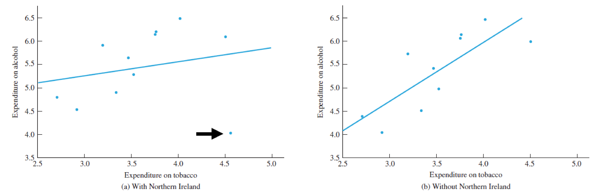
Especially true for small sample sizes
<aside class="notes">
Outliers can always influence your results. There are certain methods that can make your regression / your estimates robust against outliers (these have the fitting name, robust statistics). A very good book on robust statistics is Wilcox "Robust Statistics". Great tools are trimming (and even better winsorizing) and weighted least square regression. Ways to identify outliers are Cooks-Distnace or Leverage plots. All these things are extending the scope of the course too much and will likely not be discussed much.
</aside>

# section
<h1>Overview</h1>
- Warmup
- Why statistics
- do it yourself statistics
- Linear Regression
- **Multiple Regression**
- Categorical Variables
- Interactions and the famous 2x2 design
- Inference
- Asumptions
- Bootstrapping
- Four ways of statistics
- Equivalence of traditional tests


##
```{julia}
#| fig-height: 2
f = Figure(size=(900, 200))

ax1 = Axis(f[1,1], xlabel="drivers", ylabel="DriversKilled")
scatter!(ax1, data.drivers, data.DriversKilled)

ax2 = Axis(f[1,2], xlabel="kms/1000", ylabel="DriversKilled")
scatter!(ax2, data.kms./1000, data.DriversKilled)

ax3 = Axis(f[1,3], xlabel="PetrolPrice", ylabel="DriversKilled")
scatter!(ax3, data.PetrolPrice, data.DriversKilled)

f
```
```{julia}
#| echo: true
fit_multi = lm(@formula(DriversKilled ~ kms + drivers + PetrolPrice), data)
coeftable(fit_multi)
```
<aside class="notes">
We can include multiple predictors in our model. The interpretation is the same (or very similar) as with a single one.
If you look at the output, the important fields are below "Coefficients". Especially the column with "Estimate" is important. Std Error (means Standarderror) is also important, it gives you the estimate of the width of the sampling distribution. If this width is very large (compared to your estimate), you are quite unsure about your estimate, if it is small you are more sure. This is directly reflected in the ratio of the two, $\frac{estimate}{Std. Error}$ which is also called the t-value. Conveniently this is the next column. If we remember that there is only a single statistical test, one can now calculate a p-value for this t-value. It reflects the probability to see such a ratio of mean/SE assumed that the mean of the population is *actually* 0 (the $H_0$). **Important**: The last step is ONLY valid, if you ALSO assume that the data-generating mechanism (the population) uses normally-distributed errors (that is, the residuals are a sample from a normal distribution).

**Interpretation:**
The intercept reflects the value when all other predictors are 0 (i.e. how many drivers will die when 0km are drivven by 0 drivers with a PetrolPrice of 0). It should be immediately clear that the intercept does not necessarily reflect a useful value. The nice thing about such an additive model is that each effect estimate can be interpreted without the other ones (also called additive effects)
</aside>

## With two predictors you span a plane
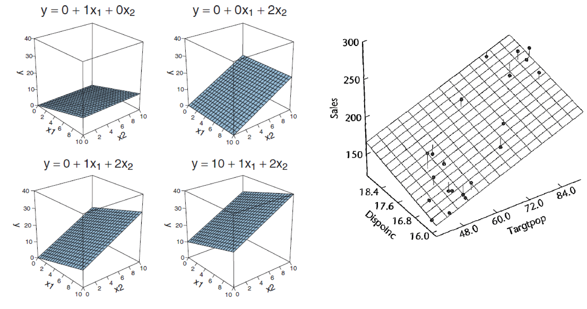
<aside class="notes">
A single predictor spans a line. Two predictors span a plane. The plane is again fitted by minimizing the residuals. If one extrapolates to more predictors, we can phrase linear regression as:
"Which plane of the column subspace of X, minimizes the residuals"
</aside>

## Overlapping variance
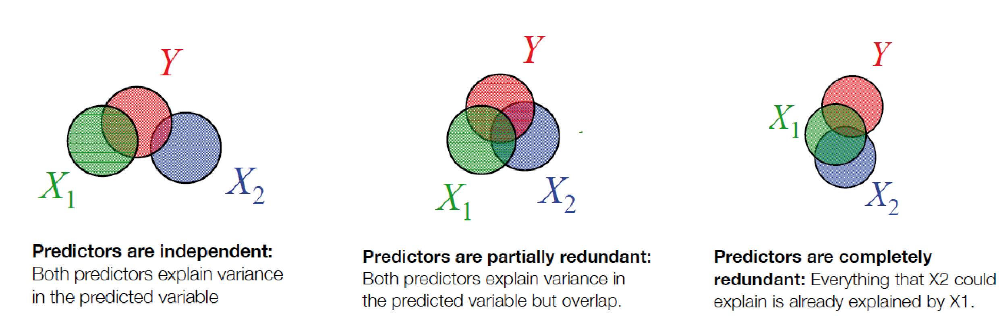

<aside class="notes">
Three different cases. The venndiagram circles show the variance of predictors ($X_1$ and $X_2$) and the dependent variable $Y$. In the first case, all is fine, $X_1$ and $X_2$ are uncorrelated and do not influence eachother. In the second case, there is some overlap. The linear model splits the variance up to the two predictors.

In the third case, everything $X_2$ can explain, is explained already by $X1$. This is usually a problem and you need to think to drop or combine predictors.

Yet another one is not displayed here, surpression. We will see in a second what it does (it is also difficult to show using venn-diagrams).

</aside>

## Perfect redundant

```{julia}
#| echo: true
data_redundant = copy(data)
data_redundant.meters = data_redundant.kms .* 1000
coeftable(lm(@formula(DriversKilled ~ meters + kms), data_redundant))
```
<aside class="notes">
As you can see, Julia automatically removed one of the predictors that was redundant
</aside>

## Partially redundant
```{julia}
#| echo: true
data_redundant = copy(data)
data_redundant.driversnoise = data_redundant.drivers .+ randn(nrow(data_redundant)) .* 10
coeftable(lm(@formula(DriversKilled ~ drivers), data_redundant))
coeftable(lm(@formula(DriversKilled ~ drivers + driversnoise), data_redundant))
```

Multicollinearity is usually not so obvious

<aside class="notes">
On this slide the important bits are the standard errors (SE) of the estimates. The upper model without a redundant predictor, the lower one with a redundant predictor. The top most code bit shows you how the redundancy wa introduced.

Not all statistic programs are as wellbehaved as R. Some might throw an error. In any case, if there is high redundancy, SE calculation can be off quite a bit.

multicollinearity / redundancy will be usually way less obvious. E.g. it could be, that a certain combination of your predictors together explain the same variance as a certain other combination. Thus, just with pairwise correlations between predictors you cannot find out whether you have collinearity. The variance influence factor might help you to check this. If you worry about redundancy/collinearity you should should follow that procedure.
</aside>

## Surpressors: Including unrelated variables can improve modelfit
```{julia}
Random.seed!(1)

S  =         randn(60) .* 10.0   # the Suppressor is normally distributed
U  = -1.*S   .+ randn(60) .* 0.1   # U (unrelated) is Suppressor plus error
R  =         randn(60)             # related part; normally distributed
OV = U + R                         # the Other Variable is U plus R

error = randn(60) .* 0.1
Y  = R .+ error

res = residuals(lm(@formula(S ~ OV)))
```
```{julia}
#| echo: false
coeftable(lm(@formula(Y ~ OV + S)))
coeftable(lm(@formula(Y ~ OV)))
```

## a graphical intuition

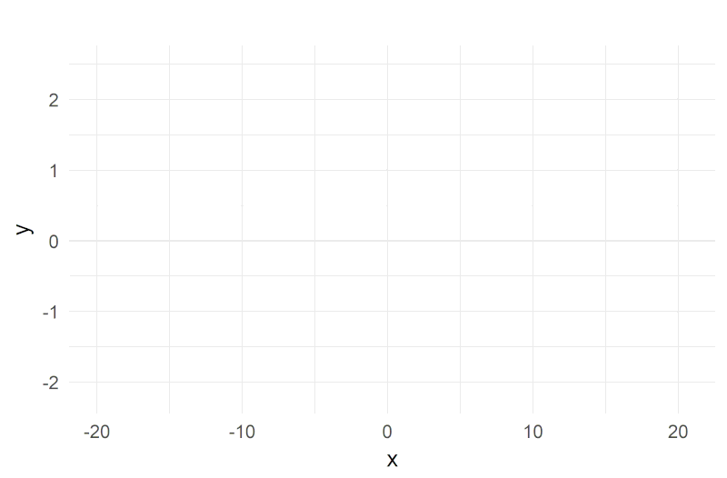

<aside class="notes">
A suppressor (`S`) is a independent variable, that is not correlated with the Y per se, but changes the estimate of other predictors (`OV`). Note how the coefficients of `OV` are completly changed by adding another variable.  The animation visualizes why this can be the case. Imagine you have a true relationship between `X` and `Y`. But then a little devil adds noise to the `X` variable. The relationship vanishes (this is what is animated). But if you know what kind of noise was added to `X` (in this case `S`), and include it in your model, the information of the true relationship can be recovered. If you want to understand why exactly have a look [at this nice stackexchange thread](https://stats.stackexchange.com/questions/33888/x-and-y-are-not-correlated-but-x-is-significant-predictor-of-y-in-multiple-regr)

The notion of suppression is also present in descriptions of confounding. The classic example of a suppressor is a confounding hypothesis described by Horst (1941) involving the prediction of pilot performance from measures of mechanical and verbal ability. When the verbal ability predictor was added to the regression of pilot performance on mechanical ability, the effect of mechanical ability increased. This increase in the magnitude of the effect of mechanical ability on pilot performance occurred because verbal ability explained variability in mechanical ability; that is, the test of mechanical ability required verbal skills to read the test directions. [taken from MacKinnon ](https://www.ncbi.nlm.nih.gov/pmc/articles/PMC2819361/)

</aside>

## A shorthand notation
$y_i = 1*\beta_0 + x_{i,1}*\beta_1 + x_{i,2}*\beta_2 + ... + x_{i,n}*\beta_n + e_i$

is nothing else than matrix multiplication

$y = X\beta+e$

$X = designmatrix$ with size $[n_{datapoints},n_{predictors}]$

$e = residuals$with size $[n_{datapoints}]$
<aside class="notes">
we will need this later. If you look up matrix multiplication the equivalency should get very obious
</aside>

## Designmatrix & algebra
```{julia}
fit_multi = lm(@formula(DriversKilled ~ kms + drivers + PetrolPrice), data)
X_mat = hcat(ones(nrow(data)), data.kms, data.drivers, data.PetrolPrice)
colnames_str = ["(Intercept)", "kms", "drivers", "PetrolPrice"]
@show X_mat[1:5, :]
```
$$ y = X\beta$$
Can be solved by:
$$ \beta = (X^TX)^{-1}X^Ty$$
<small> (don't memorize this) </small>

<aside class="notes">
The designmatrix seems to be not very helpful at the moment - after all its just a list of predictor values. But it will get interesting soon because we can code in categorical variables as well. It can be quite helpful in understanding what a model is doing (especially once you reach non-linear models)to look at the designmatrix.

Here we only use the designmatrix to show you how the betas are estimated. Later we use $(X^TX)^{-1}$ to calculate SE of the estimates.

# section 
<h1>Overview</h1>
- Warmup
- Why statistics
- do it yourself statistics
- Linear Regression
- Multiple Regression
- **Categorical Variables**
- Interactions and the famous 2x2 design
- Inference
- Asumptions
- Bootstrapping
- Four ways of statistics
- Equivalence of traditional tests


## Dummy Coding
```{julia}
#| fig-height: 4
data_factor = copy(data)
data_factor.law_label = ifelse.(data_factor.law .== 0, "no seatbelt law", "with seatbelt law")
data_factor.law_label = categorical(data_factor.law_label)

f = Figure(size=(500, 400))
ax = Axis(f[1,1], xlabel="", ylabel="DriversKilled")
for val in levels(data_factor.law_label)
    subset = filter(r -> r.law_label == val, data_factor)
    scatter!(ax, fill(val, length(subset.DriversKilled)), subset.DriversKilled, alpha=0.3)
end
f
```

## Dummy Coding

```{julia}
#| fig-height: 4
fit_law = lm(@formula(DriversKilled ~ 1 + law), data)
pred_vals = coef(fit_law)[1] .+ range(-0.5, 1.5, step=0.1) .* coef(fit_law)[2]
annotate_y = predict(fit_law, DataFrame(law=[0, 1]))

f = Figure(size=(600, 400))
ax = Axis(f[1,1], xlabel="law", ylabel="DriversKilled")
scatter!(ax, data.law, data.DriversKilled)
lines!(ax, range(-0.5, 1.5, step=0.1), pred_vals, color=:blue)
lines!(ax, [0, 0], [annotate_y[1], annotate_y[2]], color=:red, linewidth=2)
lines!(ax, [0, 1], [annotate_y[2], annotate_y[2]], color=:green, linewidth=2)
limits!(ax, -0.5, 1.5, nothing)
f
```

We code the categorical variable with 0 / 1

$y_i = \beta_0 + is\_law *\beta_1 + e_i$

<aside class="notes">
SeatbeltLaw is a categorical variable with two levels. We can code it with 0 (if level A, in this case no seatbelt) and 1 (if level B, in this case with seatbelt).
The important bit to understand here is that this is a trick. In the case of such categorical variables, we will never interpolate to other values. That is, the predictor is only defined at "0" and "1". A line per se is just a helpful reminder, that this is still regression. Why use this trick at all? Because later we want to seemingly integrate categorical and continuous predictors!
</aside>

## Interpretation
$y_i = \beta_0 + is\_law *\beta_1 + e_i$

- $\beta_0$ / Intercept: Driverskilled when $is\_law$ equals 0
- $\beta_1$ / Slope: Additional drivers killed when $is\_law$ was changed to 1
```{julia}
#| echo: true
fit_law_factor = lm(@formula(DriversKilled ~ 1 + law_label), data_factor)
coeftable(fit_law_factor)
```

## Effect Coding aka sum coding aka deviation coding
```{julia}
#| fig-height: 5
fit_law = lm(@formula(DriversKilled ~ 1 + law), data)
pred_vals = coef(fit_law)[1] .+ range(-0.5, 1.5, step=0.1) .* coef(fit_law)[2]
annotate_y = predict(fit_law, DataFrame(law=[0, 1]))

f = Figure(size=(800, 400))

# Left: original dummy coding view
ax1 = Axis(f[1,1], xlabel="law", ylabel="DriversKilled")
scatter!(ax1, data.law, data.DriversKilled)
vlines!(ax1, 0, color=:gray, linewidth=1.5, linestyle=:dash)
scatter!(ax1, [0], [125], color=:purple, markersize=30)
lines!(ax1, range(-0.5, 1.5, step=0.1), pred_vals, color=:blue)
lines!(ax1, [0, 0], [annotate_y[1], annotate_y[2]], color=:red, linewidth=2)
lines!(ax1, [0, 1], [annotate_y[2], annotate_y[2]], color=:green, linewidth=2)

# Right: effect coding view (shifted by -0.5)
ax2 = Axis(f[1,2], xlabel="law (effect coded)", ylabel="DriversKilled")
scatter!(ax2, data.law .- 0.5, data.DriversKilled)
vlines!(ax2, 0, color=:gray, linewidth=1.5, linestyle=:dash)
scatter!(ax2, [0], [coef(fit_law)[1] + 0.5*coef(fit_law)[2]], color=:purple, markersize=30)
lines!(ax2, range(-1, 1, step=0.1), pred_vals, color=:blue)
lines!(ax2, [-0.5, -0.5], [annotate_y[1], annotate_y[2]], color=:red, linewidth=2)
lines!(ax2, [-0.5, 0.5], [annotate_y[2], annotate_y[2]], color=:green, linewidth=2)
limits!(ax2, -1, 1, nothing)

f
```

Using effect coding, the interpretation of the intercept changes to the mean between groups

<small>warning: often effect coding is made using -1 and 1, then the $\beta_1$ is halve the size! using 0.5 is much more practical </small>
<aside class="notes">
Note that effect coding does not change the slope estimate, only the intercept. Also note that the intercept does not reflect mean(y). It reflects the means of the group means. This can be different if groups have different sizes. [see this description on my blog on coding schemes](https://benediktehinger.de/blog/science/dummy-coding-and-effects-coding/). For some further information see [here](https://web.pdx.edu/~newsomj/da2/ho_coding1.pdf)

It is not clear when to use which, it is more a personal matter (see blog for more discussion)
</aside>

## Multiple levels
::::
```{julia}
# Dummy coding matrix for 3-level factor
factor_levels = categorical(repeat(["low","middle","high"], inner=3))
y = factor_levels

# Model matrix (dummy coding)
X_dummy = [ones(9) [(factor_levels .== "middle").*1.0 (factor_levels .== "high").*1.0]]
@show X_dummy
```
Treatment / Dummy Coding

```{julia}
# Effect coding matrix for 3-level factor
X_effect = [ones(9)
    [(factor_levels .== "middle").*0.5 (factor_levels .== "low").*(-0.5) .* 1.0
     (factor_levels .== "high").*0.5 (factor_levels .== "low").*(-0.5) .* 1.0]]
@show X_effect
```
Effect Coding
::::
<aside class="notes">
Dummy coding and effect coding are the most popular coding scheme. I want to note here, that you can use any arbitrary linear combination of the columns. You SHOULD choose the coding scheme that matches your hypothesis. If you have a certain hypothesis, that MIDDLE + HIGH should be the same, why not code it that way? e.g. intercept + MIDDLE&HIGH + HIGH (to see why this is a linear combination, take MIDDLE&HIGH - HIGH and you get MIDDLE again). Now you can directly test what you are interested in. YOu could also use the normal coding and then run a contrast. But this gets us too far
</aside>


# section

<h1>Overview</h1>
- Warmup
- Why statistics
- do it yourself statistics
- Linear Regression
- Multiple Regression
- Categorical Variables
- **Interactions and the famous 2x2 design**
- Inference
- Asumptions
- Bootstrapping
- Four ways of statistics
- Equivalence of traditional tests


## 

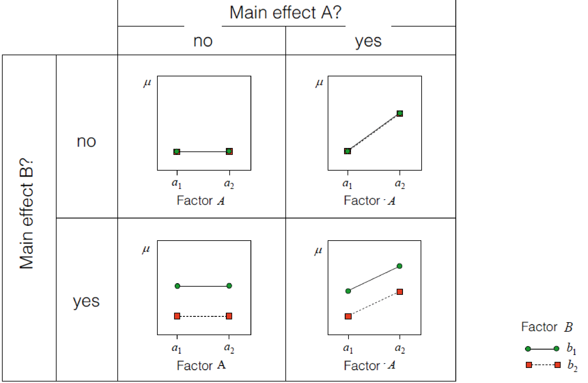
<small> errorbars/data-points ommited for clarity </small>


<aside class="notes">
An example for a 2x2 design:

We want to measure test-scores (Points in an exam, Reactiontimes...). We experimentally manipulate either the difficulty of the task (factorA, "normal" vs. "easy") or the temperature of the room (factorB, "normal, 20°" or "cool, 15°". We expect an outcome like in the lower right pannel. Both easy test and cool temperature should make you achieve higher scores (cool temperature because you keep a cool head ;-)). If only one of the two shows an effect we will be in the other two quadrants. If no intervention shows an effect we will be in the top left quadrant.

We term these main effects. What if the size of main effect A depends on main Effect B? Then we go to interactions (next slide please)
</aside>
## Interaction effects

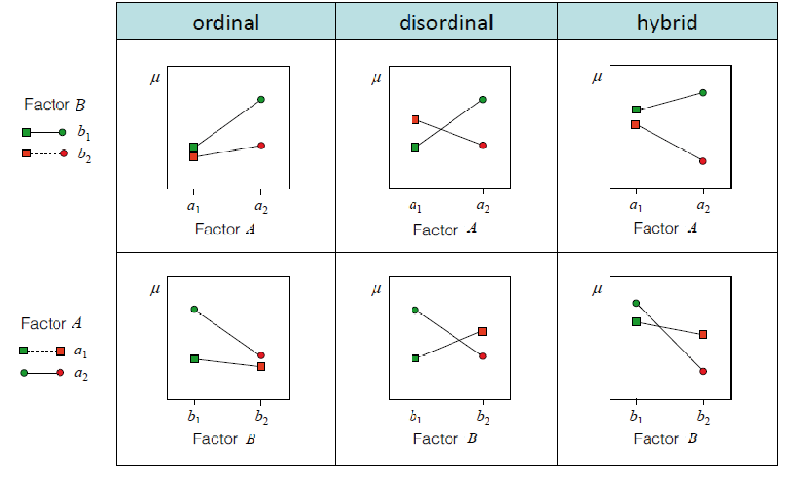


<small> not really helpful to learn these names </small>
<aside class="notes">
The columns show: Different ways interactions can look like. In the first column, the Factor A and B *on average* show an increase. In the second column, clearly something is going on, but the *average* effect of factorA/B is close to 0. The third is the mix between the first two.

The two rows show:sometimes its helpful for your understanding to look at these interactions with different "bases", i.e. put factor A or factor B on the x-axis.
</aside>


## How are interactions coded
$y = \beta_0 + factorA * \beta_1 + factorB * \beta_2 + factorA * factorB * \beta_3$

Different words for the same thing:

- The interaction shows how much the prediction needs to be changed, when both factors coocur
- The interaction is the multiplication of the columns in X of factorA and factorB
- The interaction represents the difference of differences

<aside class="notes">
Difference of differences: main effect (=$\beta_1$ or $\beta_2$) are differences, the interaction represents the effect of having both differences against not having them. The difference of differences.

In the model they are coded as multiplications of the main effects (this holds true for dummy and effect coding!). In dummy coding it might be the most intuitive. We have a column with only 1's (intercept) `1 1 1 1`, we have one colum for factor A e.g. `1 1 0 0`, and a third one for factorB `1 0 1 0`. The interaction is the effect that happens if both factorA and factorB are 1, that is only in the first row (thus the interaction is `1 0 0 0`). Appreciate that this is exactly the multiplication `1 1 0 0`*`1 0 1 0`.
</aside>


## Interactions of continuous/categorical predicotrs
$y = \beta_0 + factorA * \beta_1 + contB * \beta_2 + factorA * contB * \beta_3$
```{julia}
#| fig-height: 3
# mtcars data hardcoded
mtcars = DataFrame(
    mpg = [18.0,14.0,17.8,16.4,17.3,15.2,10.4,10.4,14.7,32.4,30.4,33.9,21.5,25.0,31.0,15.5,15.2,18.7,24.4,22.8,18.7,15.0,13.3,19.2,25.0,24.0,19.2,14.0,18.0,14.0,14.0,22.8],
    cyl = [6,6,4,6,8,6,8,8,8,4,4,4,6,6,4,6,6,4,4,4,6,8,8,8,8,8,8,8,8,8,8,4],
    disp = [160.0,160.0,108.0,258.0,360.0,225.0,360.0,360.0,146.0,140.8,148.8,78.7,120.1,351.0,168.7,167.6,167.6,107.0,146.5,140.8,167.6,275.8,460.0,440.0,79.0,120.3,95.1,350.0,318.0,304.0,350.0,120.1],
    hp = [110,110,93,110,175,105,245,175,230,66,52,65,97,123,95,110,105,65,97,62,95,180,335,230,66,97,150,245,175,230,230,105],
    drat = [3.9,3.9,3.85,3.08,3.15,2.76,3.21,3.69,3.92,4.22,4.93,4.22,3.7,3.62,4.08,3.92,3.92,4.08,4.43,4.08,3.08,3.15,2.76,3.15,2.76,3.57,3.57,3.23,3.08,3.15,2.94,3.72],
    wt = [2.620,2.875,2.320,3.215,5.424,3.460,3.440,3.440,4.070,1.615,1.650,1.625,1.935,3.440,3.330,3.840,3.845,1.935,2.140,1.835,3.170,3.570,5.250,5.424,2.330,2.465,3.520,4.000,3.840,3.845,4.070,2.770],
    qsec = [16.50,17.05,18.90,19.44,17.02,20.22,15.84,15.84,14.50,18.60,19.44,18.52,19.90,20.01,16.70,15.91,15.85,14.60,18.60,17.42,17.82,17.42,17.72,18.90,17.02,17.42,17.72,15.50,16.90,15.50,14.60,18.60],
    am = [1,1,1,0,0,0,0,0,0,1,1,1,0,0,0,0,0,1,1,1,0,0,0,0,0,0,0,0,0,0,0,1],
    gear = [4,4,4,3,3,3,3,3,3,4,4,4,3,3,4,4,4,4,4,4,3,3,3,3,4,5,5,3,3,3,3,4],
    carb = [4,4,1,1,2,1,4,2,2,2,2,1,1,2,2,4,2,2,4,2,3,3,3,3,4,2,1,4,2,2,4,2]
)
d = mtcars
d.am = categorical(d.am, levels=[0,1], ordered=false)

f = Figure(size=(600, 300))
ax = Axis(f[1,1], xlabel="weight", ylabel="horse power")
for val in levels(d.am)
    subset = filter(r -> r.am == val, d)
    scatter!(ax, subset.wt, subset.hp, color=val==0 ? :red : :blue, label=String(val))
    # Add regression line per group
    wt_s = sort(subset.wt)
    fit_g = lm(@formula(hp ~ wt), subset)
    lines!(ax, wt_s, predict(fit_g, DataFrame(wt=wt_s)), color=val==0 ? :red : :blue)
end
axislegend(ax, position=:rb)
f

m1 = lm(@formula(hp ~ wt * am), d)
coeftable(m1)
```

<aside class="notes">
If you look at the coefficient table, we now have an interaction between the slope and a categorial variable. What the coefficients mean, depends completly on the coding scheme used. Here we used dummy coding. That means, the slope for `wt`(weight) is 47.14 $\frac {hp}{ton}$. That is an increase of 1 ton results in ~50 more horsepower. But this is only true, if the factor àm` (automatic) is false! Because if it is true, then the dummy-coded column has 1's in there and the interaction kicks in. Then we have 47.14 + 63.84 $\frac {hp}{ton}$. This fact, that automatic cars have a steeper increase of horsepower per weight you can check in the plot.

Note that if you want to make the strong assumption, that there is no interaction, you can leave it out of the model. If in the true population (which you sampled) there is actually no interaction (and what we see here just happened because we had a weird/lucky sample), you will have higher power - that is you will find the true effect structure more often. But if there is actually an interaction and you did not model it, you might get big problems and conclude wrong things. Plotting & calculating at the same time might help save the day! (but beware of overfitting/HARKing!)

</aside>

## The difference between main and simple effects
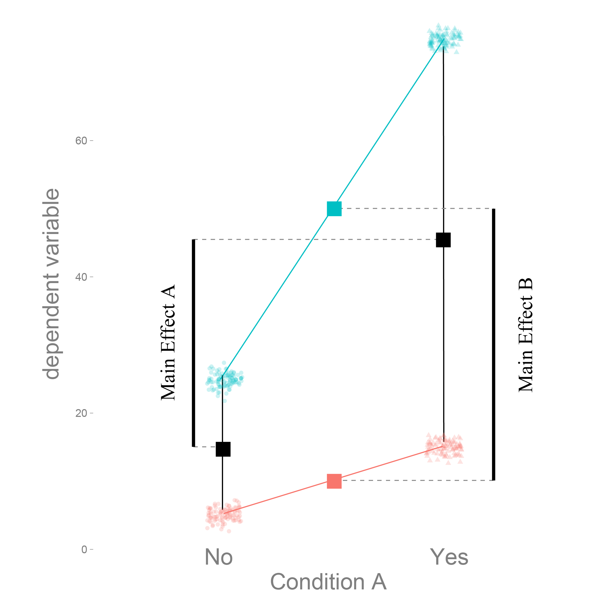

Dummy coding tests simple effects

Effect coding main effects

<aside class="notes">
**Simple effects** are the difference between e.g. condition A == Yes and condition A == No at a specific level of the other effects (e.g. Condition B == No, the difference between the two red pointclouds).

**Main effects** are the differences between conditions on the average of the other conditions. E.g. the main effect A, is the difference between condition A == yes and condition A == no, at the group-mean of the other two conditions. Why stress group mean? Because if one cell/point-cloud would have more data points than another, the mean would be shifted towards the cloud with more datapoints. [For more details and explanation see this blog post](https://benediktehinger.de/blog/science/dummy-coding-and-effects-coding/)
</aside>


## Effect coding to the help!
```{julia}
# Dummy coding (default)
coeftable(lm(@formula(hp ~ wt * am), d))

# Effect coding: recode am to -0.5/0.5
d.am_eff = (d.am .== 0) .* (-0.5) .+ (d.am .== 1) .* 0.5
m2 = lm(@formula(hp ~ wt * am_eff), d)
coeftable(m2)
```


<aside class="notes">
The top one is with dummy coding, the bottom one with effects coding. Note how the coefficients and the significance of the coefficients changed.
The slope of `wt` now represents the average slope, not the slope at a reference category as before.


But we are only half way there, we also need to center the continuous variable (next slide please)
</aside>

## Centering continuous predictors

$weight_{new} = weight - mean(weight)$

$y = \beta_0 + weight_{new}*\beta_1 + am*\beta_2 + weight_{new}*am*\beta_3$

What does $\beta_1$ and $\beta_0$ represent now?

<aside class="notes">
$\beta_1$ still represents the influence of a change in weight by 1 on the $y$. The interpretation for $\beta_0$ is the same, it is the value y takes, when all other predictors are zero. I.e. in this case now the intercept represents the value of $y$ when the weight is at its mean value. That is, with subtracting certain values from predictors, you can shift around where the 0-point is, and consequently where the intercept is.
</aside>

```{julia}
meanwt = mean(d.wt)
d.wt_new = d.wt .- meanwt

m3 = lm(@formula(hp ~ wt_new * am), d)
coeftable(m3)
```


## Interaction between two continuous variables
::::
```{julia}
#| fig-height: 4
# NOTE: hsbdemo.dta from UCLA - hardcoded sample data
Random.seed!(42)
n_soc = 200
dSoc = DataFrame(
    read = randn(n_soc) .* 10 .+ 50,
    math = randn(n_soc) .* 10 .+ 55,
    socst = randn(n_soc) .* 10 .+ 50,
    write = randn(n_soc) .* 10 .+ 50
)
# Add some interaction effect
dSoc.read .= dSoc.read .+ 0.1 .* dSoc.math .* dSoc.socst

fit_soc = lm(@formula(read ~ math * socst), dSoc)
coeftable(fit_soc)
```

```{julia}
#| fig-height: 4
df_pred = DataFrame(
    math = repeat([30, 80], inner=10),
    socst = repeat(collect(range(25, 70, length=10)), outer=2)
)
df_pred.read = predict(fit_soc, df_pred)

f = Figure(size=(500, 400))
ax = Axis(f[1,1], xlabel="math", ylabel="read")
for val in unique(df_pred.socst)
    subset = filter(r -> r.socst == val, df_pred)
    lines!(ax, subset.math, subset.read)
end
axislegend(ax, [string("socst=$v") for v in unique(df_pred.socst)], position=:rb)
f
```
::::

<aside class="notes">
Continuous/continous interactions are build exactly the same way:
$y ~ \beta_0 + x_1\beta_1 + x_2\beta_2 + x_1x_2\beta_3$
Simple multiplikation of theprevious two terms. Note that the estimated predictor can be tricky to understand.

In this example we are predicting reading skills based on math skills. The continuous interaction is a measure of social status.
</aside>

## Interaction as a plane
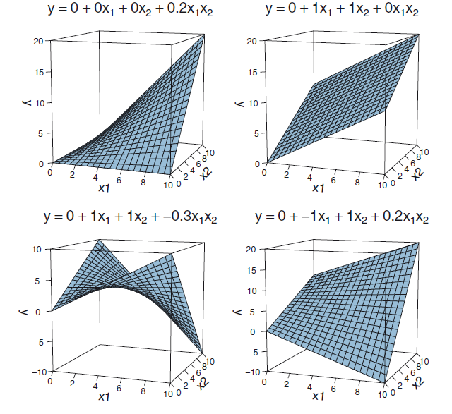
<aside class="notes">
Interaction between two continuous variables can be seen as twistings of the plane. In the top right corner we see an example without any interaction. Note how the plain is straight. If we add interactions, the slope of one factor depends on the other factor.
</aside>


# section

<h1>Overview</h1>
- Warmup
- Why statistics
- do it yourself statistics
- Linear Regression
- Multiple Regression
- Categorical Variables
- Interactions and the famous 2x2 design
- **Inference**
    - **single parameter**
    - model comparison
- Asumptions
- Bootstrapping
- Four ways of statistics
- Equivalence of traditional tests


##

Remember: There is only one statistical test


We need to specify our H0

General assumption for all of the following inference: Independence of residuals

<aside class="notes">
The residuals have to be independent from each other. That is, after modeling all effects, the noise/residuals/whats leftover  hast to be independent. If they are not, then they were not identically sampled from the population distribution and our conclusions might be completly wrong (usually its still kind of right)
</aside>

## Two general ways
### sampling distribution of predictors (walds t-test)
- walds-t = $\frac{estimate}{SE}$
- tests a single predictor
- coding scheme influences what is tested (good and bad)

<br>

### Model comparison / F-test

- Test how well a model with predictor vs. one without explain the data
- Can test sets of predictors at the same time

<br>
Generally the two tests will agree in the case of a single predictor to be tested ($(waldsT)^2 = F$).

This will be not true when we reach GLMs and in multiple regression only for high $n$

## What is a standard error?

::::
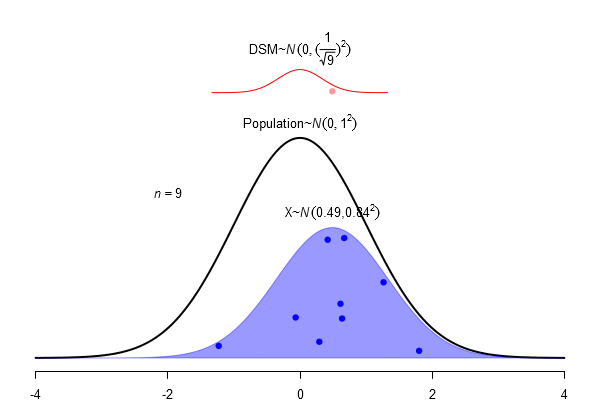

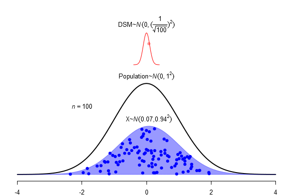
::::


$SEM = \frac \sigma{\sqrt{N}}$

<aside class="notes">
As you can see, the standard error of the mean (SEM)* is the standard deviation of the population $\sigma$ divided (I sometimes say 'punished') by the squareroot of N. The SEM is a proxy of how sure you can be, that the sample you have contains the population mean. The larger your sample, the surer you should be. Thus if you increase `n`, the SEM shrinks by $\sqrt{N}$. If the population has a small $\sigma$ in the first place, you are also more likely that your sample contains the true mean.


* You could calculate also the standard error of the standard deviation, if you want!
</aside>

## Confidence Interval as an area of the sampling distribution
```{julia}
x_mu = 2
x_sd = 1.5
x_vals = range(-5, 10, step=0.05)
dens_vals = pdf.(Normal(x_mu, x_sd), x_vals)
datsim = DataFrame(x=collect(x_vals), dens=dens_vals)
ci_bounds = quantile.(Ref(Normal(x_mu, x_sd)), [0.025, 0.975])
datsim.CI = (datsim.x .> ci_bounds[1]) .& (datsim.x .< ci_bounds[2])

f = Figure(size=(600, 400))
ax = Axis(f[1,1], xlabel="", ylabel="")

# Fill area inside CI
for (i, row) in enumerate(eachrow(datsim))
    if row.CI
        lines!(ax, [row.x, row.x], [0, row.dens], color=:blue, alpha=0.3)
    end
end

# Density line
lines!(ax, datsim.x, datsim.dens)

# SEM line
vlines!(ax, [x_mu], color=:red, linewidth=2)

# CI lines
vlines!(ax, ci_bounds, color=:blue, linewidth=2, linestyle=:dash)

# SEM error bar
hlines!(ax, 0.1, x_mu-x_sd, x_mu+x_sd, color=:red, linewidth=2)
text!(ax, 2.8, 0.12, text="SEM", color=:red)

# CI error bar
hlines!(ax, 0.2, ci_bounds[1], ci_bounds[2], color=:blue, linewidth=2)
text!(ax, 6.5, 0.22, text="95%-CI", color=:blue)

f
```


## Confidence intervals visualized
<iframe src="https://students.brown.edu/seeing-theory/frequentist-inference/index.html#section2" width="1900px" height="600px"></iframe>

## Important notes on confidence intervals
<div class="nobullets">
- An estimated mean $\hat \mu$ of a population is either in a proposed range (e.g. confidence interval) or its not.

- There is **not** a 95% probability that the population mean $\mu$ is in a calculated 95%-confidence interval

- The 95% are attached to the confidence-interval NOT the mean

- => 95% of confidence-intervals contain the population mean $\mu$

- There is no way of knowing whether your confidence interval contains $\mu$ :(
</div>

## Just to be sure: Mr. Mean
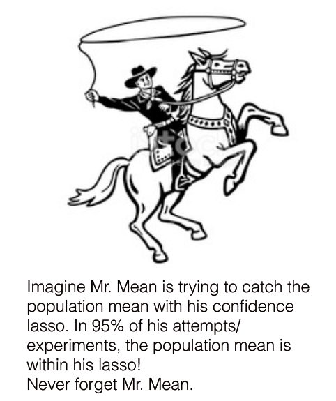

## The $H_0$ for the simple regression

$\mu$ - the mean:

- For the intercept (usually): Intercept = 0
- For the slope (usually): slope = 0

But what is the width of the sampling distribution we should use?

In other words: How does the `lm` function know what the standard errors ($\frac{\sigma}{sqrt(n)}$) are?


## Expert slide: Estimating standard errors from X

$\beta = (X^TX)^{-1}X^Ty$

$SE = \sqrt{diag(\sigma^2 (X^TX)^{-1})}$

Quickly summarized: it looks at partial correlations of X ($X^TX$ => Covariance, inverse => partial correlations) and weights them with the residuals' variance $\hat \sigma$

<aside class="notes">
This is a sort of bonus slide. If you want to learn more you can start in most multiple regression books or for a direct proof here: [here](https://math.stackexchange.com/questions/1227312/standard-error-for-the-parameters-of-a-linear-regression-model?rq=1)
Interesting things to look up are socalled "Precision Matrices" (the $(XX^T)^{-1}$)
</aside>

## Walds t-test
```{julia}
#| echo: true
coeftable(fit_soc)
```

$wald-t = \frac{\beta}{SE}$

wald-t is not normal distributed but t-distributed

<aside class="notes">
You should note here, that dividing the coefficient by the SD gives you a t-value. Looking up the t-value in the t-distribution would allow you to calculate the p-value

I tend to think of a t-value as a standardization procedure. You want a "scale-free" value. That is, you want to normalize from your coefficient scale (e.g. meter vs kilometer) to a standardized space ("t-units"). By this, you don't need to have a different sampling distribution whether you describe your coefficient in meters or in kilometers

## What is a t-distribution?
```{julia}
x_vals = range(-5, 5, step=0.1)
dfT = [1, 2, 5, 50, 100]
dens_matrix = [pdf.(TDist(df), x_vals) for df in dfT]'

datT = DataFrame(
    x = repeat(collect(x_vals), outer=length(dfT)),
    df = repeat(string.(dfT), inner=length(x_vals)),
    value = vec(dens_matrix)
)
datT.x = parse.(Float64, datT.x)

f = Figure(size=(600, 400))
ax = Axis(f[1,1], title="t-distribution", xlabel="x", ylabel="density")
for df_val in dfT
    subset = filter(r -> r.df == string(df_val), datT)
    lines!(ax, subset.x, subset.value, label="df=$(df_val)")
end
axislegend(ax, position=:rb)
f
```

Population $\sigma$ is unknown. Sampling $\hat \sigma$ has to be used.

=> Sampling distribution (for small n) is not normal distributed but student t-distributed (with given degrees of freedom)

<aside class="notes">


If we sample with small n and we need to estimate the standard deviation of the population at the same time, our sampling distribution follows a t-distribution. With high n, the t-distribution approaches the normal distribution (see how in the example df=50 and df=100 are basically identical).

Think of degrees of freedom as independent parts of information. If you have already estimated the variance ($\hat \sigma^2$) you have $n-1$ bits of information left over. If you do not have many bits of information (= datapoints) in the first place, this will "hurt", and you will be punished a lot (=> you are more unsure about your sampling distribution). If you have lots of information, missing one does not hurt.

Fun-fact: The t-distribution is the same we use in the socalled t-test. A shortcut around the linear model. If you have only two groups, the difference $x_1 - x_2$ divided by their SD $\hat \sigma$ follows a t-distribution assumed that the population has no difference $\mu = 0$. More to that at the end of this lecture
</aside>
 

# section

<h1>Overview</h1>
- Warmup
- Why statistics
- do it yourself statistics
- Linear Regression
- Multiple Regression
- Categorical Variables
- Interactions and the famous 2x2 design
- Inference
    - single parameter
    - **model comparison**
- Asumptions
- Bootstrapping
- Four ways of statistics
- Equivalence of traditional tests


## Variance Explained / F-Test
$$R^2 = 1-\frac{var(residual_{full})}{var(residual_{reduced})}$$


In order to get the variance explained of the full/reduced model we need to fit the model twice, once with the effect and once without. Conceptually, the test boils down to:
```{julia}
#| echo: true
#| eval: false
var1 = var(residuals(lm(@formula(hp ~ 1 + wt), d)))
var0 = var(residuals(lm(@formula(hp ~ 1), d)))
r2 = 1 - var1/var0
```

## Empirical distribution:

```{julia}
d = mtcars

calc_statistic(df_data) = begin
    var1 = var(residuals(lm(@formula(hp ~ 1 + wt), df_data)))
    var0 = var(residuals(lm(@formula(hp ~ 1), df_data)))
    return 1 - var1/var0
end

observed = calc_statistic(d)

singlenull() = begin
    simdat = DataFrame(wt=d.wt, hp=randn(nrow(d)) .+ mean(d.hp))
    return calc_statistic(simdat)
end

nrep = 1000
nulldist = [singlenull() for _ in 1:nrep]
pval_emp = sum(observed .< nulldist) / nrep

f = Figure(size=(600, 400))
ax = Axis(f[1,1], xlabel="null dist R²", ylabel="")
histogram!(ax, nulldist, bins=100, colormap=:virido)
vlines!(ax, [observed], color=:red, linewidth=1)
limits!(ax, 0, 1, 0, 200)
f
```

## Analytic solution
```{julia}
df1 = 2-1
df2 = nrow(d) - 1 - 1
r2_eval = range(0.01, 0.9999, step=0.01)
f_eval = (r2_eval ./ (1 .- r2_eval)) .* (df2/df1)
ana = pdf.(FDist(df1, df2), f_eval)
r2_curve = 1 .- 1 ./ (1 .+ ana .* df1/df2)

f = Figure(size=(600, 400))
ax = Axis(f[1,1], xlabel="R²", ylabel="")
histogram!(ax, nulldist, bins=100, colormap=:virido)
lines!(ax, r2_eval, 10000 .* r2_curve, color=:red)
vlines!(ax, [observed], color=:red, linewidth=1)
limits!(ax, 0, 1, 0, 200)
f
```

An analytical form is available here as well


## Usually F-distribution is used

$$ F = \frac{\frac{R^2_{m+k}-R^2_{m}}{df_1}}{\frac{1-R^2_{m+k}}{df_2}}  = \frac{R^2_{m+k}-R^2_{m}}{1-R^2_{m+k}} * \frac{df_2}{df_1}$$
with bookkeeping (for 1xk ANOVA):

$df_1 = k$, with $k$ the number of predictors

$df_2 = n - m - k -1$, with $n$ the number of observations, $m$ the number of total predictors


```{julia}
#| fig-height: 3
x_f = range(0, 5, step=0.01)

# Left plot: varying df1
df1list = [1, 3, 8]
datF1 = DataFrame(x=collect(x_f))
for df_val in df1list
    datF1[!, Symbol("df1_$df_val")] = pdf.(FDist(df_val, 30), x_f)
end

f = Figure(size=(900, 300))
ax1 = Axis(f[1,1], title="df2=30 ~= n(obs)- n(param)", xlabel="x", ylabel="density")
for df_val in df1list
    lines!(ax1, datF1.x, datF1[!, Symbol("df1_$df_val")], label="df1=$df_val")
end
limits!(ax1, nothing, nothing, 0, 2)
axislegend(ax1, position=:rb, positionrelativeinside=:topright)

# Right plot: varying df2
df2list = [1, 3, 8, 1000]
datF2 = DataFrame(x=collect(x_f))
for df_val in df2list
    datF2[!, Symbol("df2_$df_val")] = pdf.(FDist(3, df_val), x_f)
end

ax2 = Axis(f[1,2], title="df1=3 ~= n(param)-1", xlabel="x", ylabel="density")
for df_val in df2list
    lines!(ax2, datF2.x, datF2[!, Symbol("df2_$df_val")], label="df2=$df_val")
end
limits!(ax2, nothing, nothing, 0, 2)
axislegend(ax2, position=:rb, positionrelativeinside=:topright)

f
```
<aside class="notes">
Remember that we use analytic distributions to save use the simulation cost (and people did not have computers back then)

The F-value is the ratio of the additional variance explained by including the predictor $R^2_{m+k} - R^2{m}$ divided by the residual variance, what remains after the full model explained all data ($1 -R^2_{m+k}$). In other words, its a ratio of how much you gain divided by how much you still did not explain.

The deegrees of freedom are bookkeeping, i.e. you need to adapt your $R^2$ for how many variables you used etc.

I put these plots here, so you can appreciate the shape of the F-distribution. In the left plot, we fixed the number of observation to 30+df1 and vary df2 (approx ~ the number of parameters we exclude at the same time from the model). In the right plot we fix df1 to 3 and vary df (approx ~ number of observations).

What you should see is, that the F-value for a nullmodel (the distributions you see, which is related to the ratio of variances) gets larger if you increase the number of parameters (left plot) or if you increase the number of datapoints (right).
</aside>


## Overfit

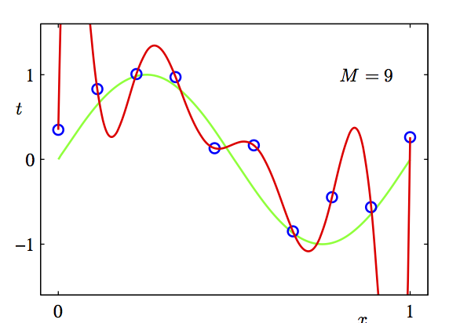

var-explained(predictorA) $<=$ Var-explained(predictorA + predictorB)

Explained-variance is not everything. We also have to take into account the number of predictors we include

<aside class="notes">
If you add any predictor to your model, the variance explained will always increase. This is one of the many problems with $R^2$. We could use $adjusted R^2$ which will reduce the $R^2$ depending on the number of parameters used. This is also a way to think why we have the degree of freedoms in the F-distribution: The more parameters we remove at the same time, the more variance we will explain just by chance => the higher the F value under the $H_0$ is.

</aside>


## Categorical predictor with multiple levels

Airbnb prices against location in Berlin (first 900 entries)

```{julia}
#| echo: false
# NOTE: Read from CSV if available
# dair = CSV.read("airbnb_berlin_1471_2017-07-21.csv", DataFrame)
# For demo purposes, generate synthetic data
Random.seed!(42)
n_air = 1500
neighborhoods = ["Mitte","Friedrichshain","Kreuzberg","Prenzlauer Berg","Charlottenburg",
                 "Neukölln","Tempelhof","Schöneberg","Spandau","Steglitz",
                 "Wedding","Treptow","Lichtenberg","Pankow","Reinickendorf",
                 "Marzahn","Hellersdorf","Hohenschönhausen","Weißensee","Lichtenberg"]
dair = DataFrame(
    neighborhood = categorical([neighborhoods[rand(1:end)] for _ in 1:n_air]),
    price = randn(n_air) .* 50 .+ 100,
    bedrooms = rand(1:5, n_air),
    reviews = rand(0:200, n_air)
)
dair.ngb = dair.neighborhood

# Add neighborhood effect
for nb in neighborhoods
    effect = rand() * 100
    idx = findall(r -> r.neighborhood == nb, eachindex(dair))
    dair.price[idx] .= dair.price[idx] .+ effect
end

d_sub = view(dair, 1:900, :)

f = Figure(size=(800, 400))
ax = Axis(f[1,1], xlabel="neighborhood", ylabel="price")
for nb in levels(d_sub.neighborhood)
    subset = filter(r -> r.neighborhood == nb, d_sub)
    scatter!(ax, fill(nb, length(subset.price)), subset.price, alpha=0.05)
    lines!(ax, [nb, nb], [0, mean(subset.price)], color=:red, linewidth=1)
end
limits!(ax, nothing, nothing, 0, 750)
f
```
<aside class="notes">
We see many different samples. We wonder - do they all come from the same distribution and the observed differences in mean between the actegories are we just sampling error?
</aside>

## Testing
::::
```{julia}
#| echo: true
fit_ngb = lm(@formula(price ~ 1 + ngb), d_sub)
coeftable(fit_ngb)
```


::::
<aside class="notes">
Please never just pick the parameter that was significant and report only that one. This will be highly missleading.

There are ways to do this more or less correctly i.e. multiple comparison correction or hierarchical models over the effects (usually in a bayesian sense). We will not dive into these in this course.
</aside>
## Testing
```{julia}
#| echo: true
m0 = lm(@formula(price ~ 1), d_sub)
m1 = lm(@formula(price ~ 1 + ngb), d_sub)
r²0 = r_squared(m0)
r²1 = r_squared(m1)
n = nrow(d_sub)
p1 = length(coef(m1)) - 1
p0 = length(coef(m0)) - 1
f_stat = ((r²1 - r²0) / (p1 - p0)) / ((1 - r²1) / (n - p1 - 1))
p_val = 1 - cdf(FDist(p1 - p0, n - p1 - 1), f_stat)
"F-statistic: $round(f_stat, digits=2), p-value: $round(p_val, digits=4)"
```


<aside class="notes">
Here we show that individual levels of factors can be significant, but the bulk (the whole factor) tested via model comparison could indicate that there is no difference (or a weaker one). Most often these tests show you the same results. If they differ it will be usually because you do not have enough certainty (i.e. not enough data or too much noise). In such cases be very careful with your interpretations (what that means is: don't think this is now a true fact because p<0.05. It is likely not. Discuss that even you show significance, you have limited applicability. Always think that this is a single sample, other samples could show same effect or could indicate that you were lucky (unlucky?) this time.

</aside>

## an graphical way to think about it

```{julia}
#| echo: false
f = Figure(size=(900, 400))

# Left: model with per-neighborhood means
ax1 = Axis(f[1,1], xlabel="neighborhood", ylabel="price")
for nb in levels(d_sub.neighborhood)
    subset = filter(r -> r.neighborhood == nb, d_sub)
    scatter!(ax1, fill(nb, length(subset.price)), subset.price, alpha=0.05)
    lines!(ax1, [nb, nb], [0, mean(subset.price)], color=:red, linewidth=1)
end
limits!(ax1, nothing, nothing, 0, 750)

# Right: model with single mean
ax2 = Axis(f[1,2], xlabel="neighborhood", ylabel="price")
for nb in levels(d_sub.neighborhood)
    subset = filter(r -> r.neighborhood == nb, d_sub)
    scatter!(ax2, fill(nb, length(subset.price)), subset.price, alpha=0.05)
end
hlines!(ax2, mean(d_sub.price), color=:red, linewidth=2)
limits!(ax2, nothing, nothing, 0, 750)

f
```

## Coming back to a 2x2 design. Which order to test effects?
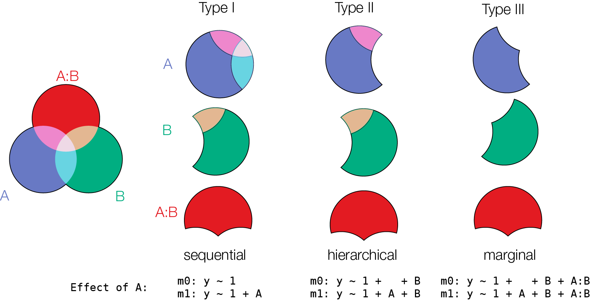

<aside class="notes">
The first diagram shows how much variance each effect can explain. As you can see, there is some overlap (that is e.g. predictor A and B explain some identical variance). The graph needs to be seen chronological, you start in the first row. For Type I you explain everything there is to be explained by A. Then you add B and explain whatever is left, then you add the interaction. For type II, you remove all higher interactions containing this factor (here only A:B, but could be A:C or A:B:C as well). Then you compare a model with your factor (1 + A + B) , against a model without the factor (1 + B). Type III is very similar, but in addition you include the interaction, thus everything explained by A:B is also removed.

It's quite safe to say that you should not use type I. There is a large controversy over choosing type II or III. I hope your data analytical choises do not influence your results, but if they do - state it! In any case report which type you use.
</aside>

```{julia}
#| include: false
Random.seed!(1)
facA = repeat([0,0,0,0,1], outer=5)
facB = repeat([0,1], outer=5)
X_exp = collect(Iterators.product(facA, facB))
X_mat = hcat(facA, facB, facA .* facB)
y_sim = X_mat * [0.5, 1.0, 1.0] .+ randn(length(facA)) .* 3
dsim = DataFrame(A=categorical(facA), B=categorical(facB), y=y_sim)
```
```{julia}
#| include: false
dsim.A_num = Int.(dsim.A)
dsim.B_num = Int.(dsim.B)
m0 =     lm(@formula(y ~ 1), dsim)
mA =     lm(@formula(y ~ 1 + A_num), dsim)
mB =     lm(@formula(y ~ 1 + B_num), dsim)
mAB =    lm(@formula(y ~ 1 + A_num + B_num), dsim)
mAB_int = lm(@formula(y ~ 1 + A_num + B_num + A_num:B_num), dsim)
mA_int = lm(@formula(y ~ 1 + A_num + A_num:B_num), dsim)
mB_int = lm(@formula(y ~ 1 + B_num + A_num:B_num), dsim)
m_int =  lm(@formula(y ~ 1 + A_num:B_num), dsim)
```


## Model comparison does not care about recoding

::::

```{julia}
#| echo: false
d = mtcars
# Dummy coding
coeftable(lm(@formula(hp ~ wt * am), d))
# Effect coding
d.am_eff = (d.am .== 0) .* (-0.5) .+ (d.am .== 1) .* 0.5
coeftable(lm(@formula(hp ~ wt * am_eff), d))
```

Walds-T test cares (simple vs. main effects)


```{julia}
#| echo: false
d = mtcars
# Model comparison (F-test) - same for both codings
m_dummy = lm(@formula(hp ~ wt * am), d)
d.am_eff = (d.am .== 0) .* (-0.5) .+ (d.am .== 1) .* 0.5
m_effect = lm(@formula(hp ~ wt * am_eff), d)
r²_dummy = r_squared(m_dummy)
r²_effect = r_squared(m_effect)
"R² dummy: $round(r²_dummy, digits=4), R² effect: $round(r²_effect, digits=4)"
```

model comparison does not care!
::::

<aside class="notes">
Here we show how changing the coding-scheme can influence the significance of your predictors if we use walds-test (see previous slides).
This is not the case if we make use of model comparisons (using F-Test or as seen on Day-3 the very related likelihood ratio test.
</aside>


# section

<h1>Overview</h1>
- Warmup
- Why statistics
- do it yourself statistics
- Linear Regression
- Multiple Regression
- Categorical Variables
- Interactions and the famous 2x2 design
- Inference
- **Asumptions**
- Bootstrapping
- Four ways of statistics
- Equivalence of traditional tests


##
- **L**inearity of responses
- **I**ndependence
- **N**ormality
- **E**qual variance
```{julia}
Random.seed!(1)
dsim = DataFrame(x = rand(100) .* 10)
dsim.y_lin = randn(100) .+ dsim.x.^2
dsim.y_independence = randn(100) .+ dsim.x
dsim.y_normality = randn(100).^2 .+ dsim.x
dsim.y_equalvariance = randn(100) .* dsim.x .+ dsim.x

alpha = 0.9
for k in 2:nrow(dsim)
    dsim.y_independence[k] = alpha * dsim.y_independence[k-1] + (1-alpha) * dsim.y_independence[k]
end
```


## Linearity of responses
```{julia}
f = Figure(size=(600, 400))
ax = Axis(f[1,1], xlabel="x", ylabel="y_lin")
scatter!(ax, dsim.x, dsim.y_lin)
# Add regression line
fit_lin = lm(@formula(y_lin ~ x), dsim)
x_s = sort(dsim.x)
lines!(ax, x_s, predict(fit_lin, DataFrame(x=x_s)), color=:blue, linewidth=2)
f
```


## Linear response
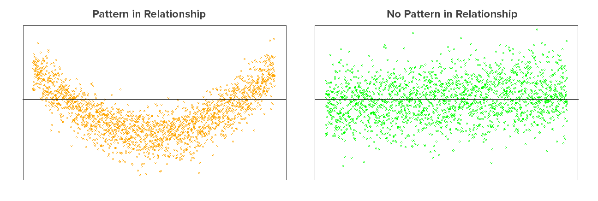
<aside class="notes">
You are trying to model linear relationships. Thus if the relationships are not linear, you need to do something! One thing would be to transform your explanatory variables (i.e. in this example on the left you could include a quadratic version of the predictor). The other is to use non-linear Linear models. Those are referred to as GAMs or spline regression.

[taken from here](https://clevertap.com/blog/a-brief-primer-on-linear-regression-part-ii/)
</aside>

## Independence of residuals
```{julia}
f = Figure(size=(900, 400))
ax1 = Axis(f[1,1], xlabel="x", ylabel="y_independence")
scatter!(ax1, dsim.x, dsim.y_independence)
x_s = sort(dsim.x)
lines!(ax1, x_s, sort(predict(lm(@formula(y_independence ~ x), dsim), DataFrame(x=x_s))), color=:blue)

ax2 = Axis(f[1,2], xlabel="index", ylabel="y_independence")
scatter!(ax2, 1:nrow(dsim), dsim.y_independence)
lines!(ax2, 1:nrow(dsim), predict(lm(@formula(y_independence ~ 1 + x), dsim)), color=:blue)
f
```

<aside class="notes">
Another example of dependent variables are measurements from the same subject. If intuition serves you well, it should be clear that often data (e.g. reaction times) from one subject are more similar than data from another subject. If we do not model this similarity/dependency correctly we will make mistakes. In our case, we would think that we have $n=100$ data points and thus 100 degree of freedom / bits of information that are independent. But actually in our example we have way less. This can be seen by resorting the data by a hidden factor.


While random sampling is important for causal declarations, it also helps us to ensure independence.

We will hear a lot more on this on the fourth day.
</aside>

## Normality of residuals
```{julia}
f = Figure(size=(600, 400))
ax = Axis(f[1,1], xlabel="x", ylabel="y_normality")
scatter!(ax, dsim.x, dsim.y_normality)
fit_n = lm(@formula(y_normality ~ x), dsim)
x_s = sort(dsim.x)
lines!(ax, x_s, predict(fit_n, DataFrame(x=x_s)), color=:blue, linewidth=2)
f
```


##Checking Assumptions: Normality using QQplots
```{julia}
#| echo: false
#| fig-width: 8
#| fig-height: 3
Random.seed!(1)
n_qq = 1000
gaussian_rv = randn(n_qq)

# QQ plot data
sorted_data = sort(gaussian_rv)
theoretical_quantiles = quantile.(Ref(Normal(0, 1)), [(i-0.5)/n_qq for i in 1:n_qq])

f = Figure(size=(800, 300))

# Left: Histogram with normal curve
ax1 = Axis(f[1,1], title="Gaussian Distribution", xlabel="Z", ylabel="")
histogram!(ax1, gaussian_rv, bins=30, colormap=:virido)
x_smooth = range(minimum(gaussian_rv), maximum(gaussian_rv), length=100)
lines!(ax1, x_smooth, pdf.(Normal(mean(gaussian_rv), std(gaussian_rv)), x_smooth), color=:red, linewidth=2)

# Right: QQ plot
ax2 = Axis(f[1,2], title="Q-Q Plot", xlabel="Theoretical Quantiles", ylabel="Sample Quantiles")
scatter!(ax2, theoretical_quantiles, sorted_data, markersize=3)
# QQ line
slope_qq = std(gaussian_rv)
intercept_qq = mean(gaussian_rv)
lines!(ax2, extrema(theoretical_quantiles), x -> intercept_qq .+ slope_qq .* x, color=:blue, linewidth=2)

f
```

Source: [Sean Kross](https://seankross.com/2016/02/29/A-Q-Q-Plot-Dissection-Kit.html)


<aside class="notes">
There are explicit tests for normality, e.g. Lillifors or even better the Shapiro-Wilk- Test. They are problematic because they always test the H_0 that the data are normal distributed. as we already know, a test assuming H_0 cannot be used to test H_0. A different concern is, that these tests always use one specific feature to test for normality. It is quite likely that one test will give you a pass, another a fail.
A common argument is, that once 30+ subjects are measured, on can invole the central limit theorem and assume that the population over subjects follows a normal distribution (because they are based on a mix of many distributions). This is a somewhat dubious argument in my interpretation. If you have large effects, these assumptions do not matter much. If data is limited, they matter a lot! I recommend reporting different kinds of robustness analysis which circumenvent some of the assumptions (e.g. test log(data), non-parametric test etc.). In the end a statistical decision (whether you believe the effect or not) will stay  subjective regardless.
Also bootstrapping might help a lot!
</aside>

##
```{julia}
#| echo: false
#| fig-width: 8
#| fig-height: 3.5
skew_right = vcat(gaussian_rv[gaussian_rv .> 0] .* 2.5, gaussian_rv)

sorted_sr = sort(skew_right)
n_sr = length(skew_right)
theo_q_sr = quantile.(Ref(Normal(0, 1)), [(i-0.5)/n_sr for i in 1:n_sr])

f = Figure(size=(800, 300))
ax1 = Axis(f[1,1], title="Skewed Right", xlabel="Z", ylabel="")
histogram!(ax1, skew_right, bins=30, colormap=:virido)
x_s2 = range(minimum(skew_right), maximum(skew_right), length=100)
lines!(ax1, x_s2, pdf.(Normal(mean(skew_right), std(skew_right)), x_s2), color=:red, linewidth=2)

ax2 = Axis(f[1,2], title="Q-Q Plot", xlabel="Theoretical Quantiles", ylabel="Sample Quantiles")
scatter!(ax2, theo_q_sr, sorted_sr, markersize=3)
slope_qq2 = std(skew_right)
intercept_qq2 = mean(skew_right)
lines!(ax2, extrema(theo_q_sr), x -> intercept_qq2 .+ slope_qq2 .* x, color=:blue, linewidth=2)
f
```

```{julia}
#| echo: false
#| fig-width: 8
#| fig-height: 3.5
skew_left = vcat(gaussian_rv[gaussian_rv .< 0] .* 2.5, gaussian_rv)

sorted_sl = sort(skew_left)
n_sl = length(skew_left)
theo_q_sl = quantile.(Ref(Normal(0, 1)), [(i-0.5)/n_sl for i in 1:n_sl])

f = Figure(size=(800, 300))
ax1 = Axis(f[1,1], title="Skewed Left", xlabel="Z", ylabel="")
histogram!(ax1, skew_left, bins=30, colormap=:virido)
x_s3 = range(minimum(skew_left), maximum(skew_left), length=100)
lines!(ax1, x_s3, pdf.(Normal(mean(skew_left), std(skew_left)), x_s3), color=:red, linewidth=2)

ax2 = Axis(f[1,2], title="Q-Q Plot", xlabel="Theoretical Quantiles", ylabel="Sample Quantiles")
scatter!(ax2, theo_q_sl, sorted_sl, markersize=3)
slope_qq3 = std(skew_left)
intercept_qq3 = mean(skew_left)
lines!(ax2, extrema(theo_q_sl), x -> intercept_qq3 .+ slope_qq3 .* x, color=:blue, linewidth=2)
f
```

##
```{julia}
#| echo: false
#| fig-width: 8
#| fig-height: 3.5
fat_tails = vcat(gaussian_rv .* 2.5, gaussian_rv)

sorted_ft = sort(fat_tails)
n_ft = length(fat_tails)
theo_q_ft = quantile.(Ref(Normal(0, 1)), [(i-0.5)/n_ft for i in 1:n_ft])

f = Figure(size=(800, 300))
ax1 = Axis(f[1,1], title="Fat Tails", xlabel="Z", ylabel="")
histogram!(ax1, fat_tails, bins=30, colormap=:virido)
x_s4 = range(minimum(fat_tails), maximum(fat_tails), length=100)
lines!(ax1, x_s4, pdf.(Normal(mean(fat_tails), std(fat_tails)), x_s4), color=:red, linewidth=2)

ax2 = Axis(f[1,2], title="Q-Q Plot", xlabel="Theoretical Quantiles", ylabel="Sample Quantiles")
scatter!(ax2, theo_q_ft, sorted_ft, markersize=3)
slope_qq4 = std(fat_tails)
intercept_qq4 = mean(fat_tails)
lines!(ax2, extrema(theo_q_ft), x -> intercept_qq4 .+ slope_qq4 .* x, color=:blue, linewidth=2)
f
```

## A nice trick
simulate datasets with same specifications and compare
```{julia}
#| echo: false
Random.seed!(1)
gaussian_rv_15 = randn(15)
sampledata = vcat(gaussian_rv_15[gaussian_rv_15 .> 0] .* 3.5, gaussian_rv_15)

# Generate 24 replicate normal datasets
dQQ_matrix = randn(length(sampledata), 25)
dQQ_matrix[:, 25] = sampledata

dQQ_long = DataFrame(
    value = vec(dQQ_matrix'),
    group = repeat(1:25, inner=length(sampledata))
)

f = Figure(size=(800, 400))
for (i, g) in enumerate(1:25)
    row, col = divrem(i-1, 5) .+ 1
    subset = filter(r -> r.group == g, dQQ_long)
    sorted_s = sort(subset.value)
    n_s = length(sorted_s)
    theo_q = quantile.(Ref(Normal(0, 1)), [(j-0.5)/n_s for j in 1:n_s])

    ax = Axis(f[row, col], title="Group $g")
    scatter!(ax, theo_q, sorted_s, markersize=3)
    lines!(ax, extrema(theo_q), x -> mean(subset.value) .+ std(subset.value) .* x, color=:blue)
end
f
```
<aside class="notes">
I simulate here 24 sets out of a normal distribution. One of these (number 25) is the original dataset I want to test. In this case I would probably conclude that there is some unexpected skew
</aside>

## Equal variance
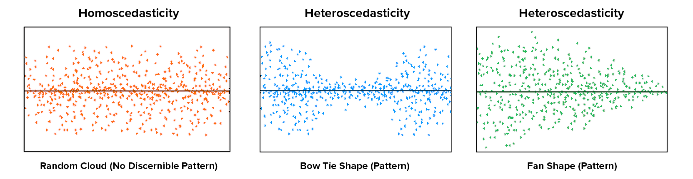


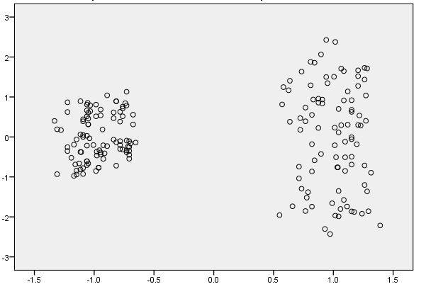


<aside class="notes">
You assume a single $\sigma$ for your residuals. If you have non-constant variance, you violate this assumption. There are explicit ways to model differing variance, but they are non-standard. Sometimes its possible to transform your dependent variable, so that the difference in variance is smaller. Weighted Sum of Squares could also be a solution.

[taken from here](https://clevertap.com/blog/a-brief-primer-on-linear-regression-part-ii/)
</aside>


# section
<h1>Overview</h1>
- Warmup
- Why statistics
- do it yourself statistics
- Linear Regression
- Multiple Regression
- Categorical Variables
- Interactions and the famous 2x2 design
- Inference
- Asumptions
- **Bootstrapping**
- Four ways of statistics
- Equivalence of traditional tests


## A bootstrap visualization
<iframe src="https://students.brown.edu/seeing-theory/frequentist-inference/index.html#section3" width="1900px" height="600px"></iframe>


## Why bootstrapping?

<br>
<br>

- Violated assumptions
- Unknown analytical + $H_0$ distribution


## Bootstrap for regression
<video width="100%" height="100%" controls>
  <source src="images/bootstrap2.mp4" type="video/mp4">
Your browser does not support the video tag.
</video>

## Bootstrapping in Julia

```{julia}
#| echo: false
fit_bs = lm(@formula(read ~ math * socst), dSoc)
coeftable(fit_bs)

# Manual bootstrap
function bootstrap_coefs(data_df, n_boots)
    n = nrow(data_df)
    coefs_storage = zeros(n_boots, length(coef(fit_bs)))
    for b in 1:n_boots
        idx = rand(1:n, n)
        boot_data = data_df[idx, :]
        fit_boot = lm(@formula(read ~ math * socst), boot_data)
        coefs_storage[b, :] = coef(fit_boot)
    end
    return coefs_storage
end

Random.seed!(42)
bootres = bootstrap_coefs(dSoc, 1000)
```
```{julia}
#| echo: false
coef_names = names(coef(fit_bs))
dboot = DataFrame(
    coefficient = repeat(coef_names, outer=1000),
    value = vec(bootres')
)
dboot.coefficient = categorical(dboot.coefficient)

f = Figure(size=(800, 400))
for (i, cn) in enumerate(unique(dboot.coefficient))
    row, col = divrem(i-1, 2) .+ 1
    subset = filter(r -> r.coefficient == cn, dboot)
    ax = Axis(f[row, col], title=String(cn), xlabel="coefficient", ylabel="")
    histogram!(ax, subset.value, bins=30, colormap=:virido)
end
f
```
<aside class="notes">

This is one way to perform a bootstrap in Julia. The bootstrap function does the resampling. One just needs to define a function that gets the data and an index to shuffle it. The shuffling here happens in `data_df[idx, :]`. We run the model on the new data and calculate the `coef`icients.

We can plot the bootstrap distributions to inspect them. But usually we are more interested in summary statements directly.
</aside>

## Continued

```{julia}
#| echo: true
# Bootstrap confidence interval (percentile method)
boot_coefs_math_socst = bootres[:, findfirst(->true, ["math:socst" in cn for cn in coef_names])]
if isempty(boot_coefs_math_socst)
    boot_coefs_math_socst = bootres[:, end]  # fallback to last coefficient
end
ci_lower = quantile(boot_coefs_math_socst, 0.025)
ci_upper = quantile(boot_coefs_math_socst, 0.975)
"Bootstrap 95% CI: ($round(ci_lower, digits=4), $round(ci_upper, digits=4))"

# Analytic confidence interval
ci_analytic = confint(fit_bs)
"Analytic 95% CI: $ci_analytic"
```


<aside class="notes">
We then make use of another function for bootstrap CI. This functions extracts the 95% percentile of the bootstrapped 'samplin' coefficient distribution (in a smart way, the *bca* stands for bias corrected accelerated, no space to explain here, but should be used as default). This 95% percentile corresponds to the confidence interval (because by bootstrapping we effectively build the sampling distribution)
</aside>

# section

<h1>Overview</h1>
- Warmup
- Why statistics
- do it yourself statistics
- Linear Regression
- Multiple Regression
- Categorical Variables
- Interactions and the famous 2x2 design
- Inference
- Asumptions
- Bootstrapping
- **Four ways of statistics**
- Equivalence of traditional tests
  - Fisher
  - Neyman-Pearson
  - NHST (Null Hypothesis Testing)
  - Bayes

<aside class="notes">
I really recommend [this paper by Jose D. Perezgonzalez](https://www.ncbi.nlm.nih.gov/pmc/articles/PMC4347431/).
</aside>
## Fisher
  - p-values are *a continuous measure of evidence against the $H_0$*
  - "Significant" p-values can be defined ad-hoc, i.e. what you think is enough evidence for this one test
  - a sensitivity analysis (~power analysis) can be performed but is not necessary
  - General idea: A single experiment should inform your decisions
  <aside class="notes">
   for all intents and purposes, p=.049 and p=.051 constitute an identical amount of evidence against the null hypothesis [source](https://stats.stackexchange.com/questions/23142/when-to-use-fisher-and-neyman-pearson-framework)
  </aside>

## Neyman-Pearson
  - p-values are only used to be threshold by $\alpha$
  - the pre-analysis fixed $\alpha$ denotes the error-probability to receive false positives
  - a power analysis is required and is part of the test
  - a p-value of 0.049 and 0.001 give the same evidence (with $\alpha=0.05$)
  - General idea: Its all about long-term properties. A single experiment does not really help

<aside class="notes">
Neyman really wanted to have a decision at the end of the test. Do I have significance or not - no grey area.
</aside>

## Type I vs. Type II errors
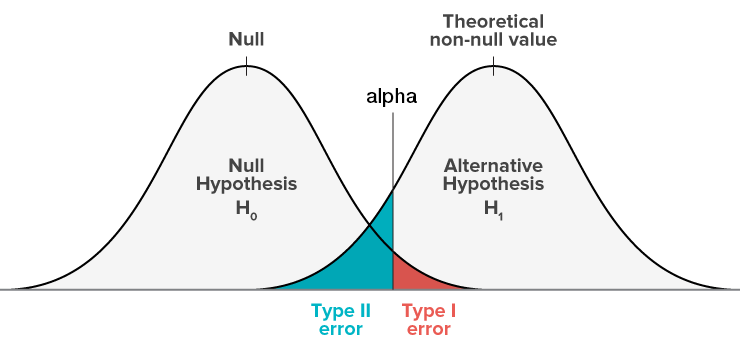

<small>[image source](https://grasshopper.com/blog/the-errors-of-ab-testing-your-conclusions-can-make-things-worse/)</small>

## Type Errors
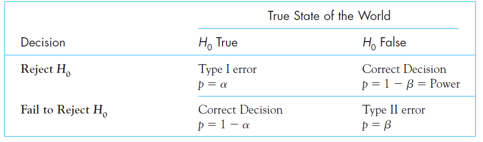
<aside class="notes">
Alpha is referring to the probability to commit a Type I error.

This probability is typically set to **0.05**.

Note: Setting the alpha to this value was more or less an arbitrary choice.
However, it is a rather strict convention now.

</aside>
## NHST
  A dark mix between Fisher & Neyman-Pearson is currently used. This is evident by calculating a p-value, p-values below $\alpha$
are significant (NP). But exact p-values are still reported.

This is a very popular mix - but is not consistent. Either you want to accept / reject a finding (and be correct on the long run) or you want to identify how much evidence you have from your sample (and act according to how much evidence you have).

## Bayes
  - parameter estimates (combined with the **apropriate** aka **fully informed** prior) reflect the probability of the true parameter being this value
  - P-Values are of no use - one can contrast two opposing hypotheses directly (e.g. model-selection)
  - usually not interested in testing hypotheses, but more on estimating likely ranges of parameters


## An intuition on the difference between Bayes & Frequentist

<div id="left">
- Frequentist:
    - All about the sampling distribution
    - probabilities are frequencies of (hypothetical) outcomes
    - Hypothetical Population and experiments (=> sampling distribution)
    - A population-parameter has a true value
    - "top down"
</div><div id="right">
- Bayesian:
    - All about the (subjective*) probabilities of parameters
    - probabilities are plausibilities/certainties
    - population-parameters are uncertain
    - "bottom up"
</div>

<br> <br>
They can result in exactly the same numbers. But interpretation vastly different!


* sometimes called subjective because of subjective choice of priors

## Be both if you can!

Come join our Seminar: "Statistical Rethinking Reading Club" next semester
<div id="left">
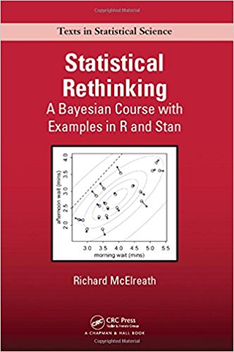

</div><div id="right">
> "This is a rare and valuable book that combines readable explanations, computer code, and active learning."
—Andrew Gelman, Columbia University

> "...an impressive book that I do not hesitate recommending for prospective data analysts and applied statisticians!"
—Christian Robert, Université Paris-Dauphine (review)

> "A pedagogical masterpiece..."
—Rasmus Bååth, Lund University

> "The content of this book has been developed over a decade+ of McElreath's teaching and mentoring of graduate students, post docs, and other colleagues, and it really shows."
—Brian Wood, Yale

> "...omg suddenly everything makes sense..."
—Ecstatic anonymous reader

</div>
# section
<h1>Overview</h1>
- Warmup
- Why statistics
- do it yourself statistics
- Linear Regression
- Multiple Regression
- Categorical Variables
- Interactions and the famous 2x2 design
- Inference
- Asumptions
- Bootstrapping
- Four ways of statistics
- **Equivalence of traditional tests**


## Correlation

  $$r = \frac{cov_{XY}}{\sigma_X\sigma_Y}$$
  $$ Y = \beta_0 + X\beta_1$$
  $$ r = \beta_1\frac{\sigma_X}{\sigma_Y}$$

```{julia}
#| echo: false
# coef(lm(Y~X))[2] * sd(X)/sd(Y)
# cor(X, Y)
```

Alternative: standardize both Y & X (e.g. $Y^* = \frac{Y}{\sigma_Y}$) before fitting the regression, you will receive correlations


## t-test
Test for two groups: $t = \frac{\hat \mu_1 - \hat \mu_2}{\sqrt{SE_1^2 + SE_2^2}}$
```{julia}
#| echo: true
# Welch's t-test equivalent
#y0 = data.DriversKilled[data.law .== 0]
#y1 = data.DriversKilled[data.law .== 1]
#t_stat = (mean(y0) - mean(y1)) / sqrt(var(y0)/length(y0) + var(y1)/length(y1))
#df_t = (var(y0)/length(y0) + var(y1)/length(y1))^2 /
#        ((var(y0)/length(y0))^2/(length(y0)-1) + (var(y1)/length(y1))^2/(length(y1)-1))
#p_val_t = 2 * (1 - cdf(TDist(df_t), abs(t_stat)))
#"t-statistic: $round(t_stat, digits=2), p-value: $round(p_val_t, digits=4)"#

# Linear model equivalent
#fit_t = lm(@formula(DriversKilled ~ 1 + law), data)
#coeftable(fit_t)
```

<aside class="notes">
The lines of interest are the ones with "t = 4.79". You can find the in both outputs, the t-test as well as the linear model with a single categorical variable - nice!
</aside>

## ANOVA
```{julia}
#| echo: true
d = mtcars
d.gear = categorical(d.gear)

# ANOVA via model comparison
l1 = lm(@formula(hp ~ 1 + gear), d)
l0 = lm(@formula(hp ~ 1), d)
r²_l1 = r_squared(l1)
r²_l0 = r_squared(l0)
n_anova = nrow(d)
p_l1 = length(coef(l1)) - 1
p_l0 = length(coef(l0)) - 1
f_anova = ((r²_l1 - r²_l0) / (p_l1 - p_l0)) / ((1 - r²_l1) / (n_anova - p_l1 - 1))
p_anova = 1 - cdf(FDist(p_l1 - p_l0, n_anova - p_l1 - 1), f_anova)
"F-statistic: $round(f_anova, digits=2), p-value: $round(p_anova, digits=4)"
```
<aside class="notes">
You could also use the `anova`on the linea model output to get the anova table
</aside>

## ANCOVA
```{julia}
#| echo: true
# Bla Using the synthetic airbnb data
#d_sub800 = view(dair, 1:800, :)

#l1_ancova = lm(@formula(price ~ 1 + bedrooms + reviews), d_sub800)
#l0_ancova = lm(@formula(price ~ 1 + bedrooms), d_sub800)
#r²_1 = r_squared(l1_ancova)
#r²_0 = r_squared(l0_ancova)
#n_a = nrow(d_sub800)
#p_1 = length(coef(l1_ancova)) - 1
#p_0 = length(coef(l0_ancova)) - 1
#f_ancova = ((r²_1 - r²_0) / (p_1 - p_0)) / ((1 - r²_1) / (n_a - p_1 - 1))
#p_ancova = 1 - cdf(FDist(p_1 - p_0, n_a - p_1 - 1), f_ancova)
#"F-statistic: $round(f_ancova, digits=2), p-value: $round(p_ancova, digits=4)"
```


## recommendations
I like these books:
  - Statistical Rethinking
  - (more math) Advanced Data Analysis from an elemental point view (Cosma Shalizi)

I like these webpages:
  https://www.flutterbys.com.au/stats/

## And thats it!


