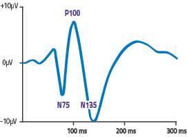
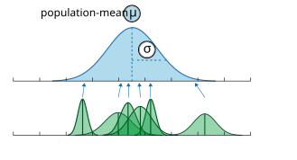
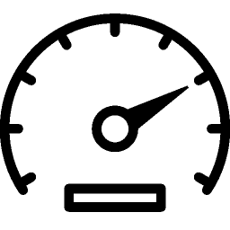
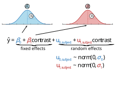
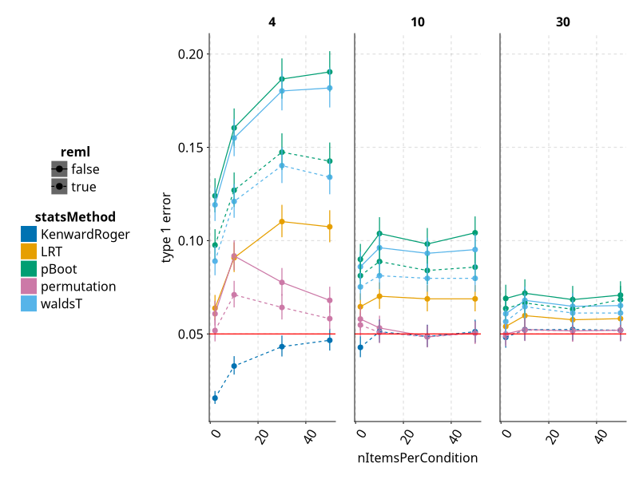
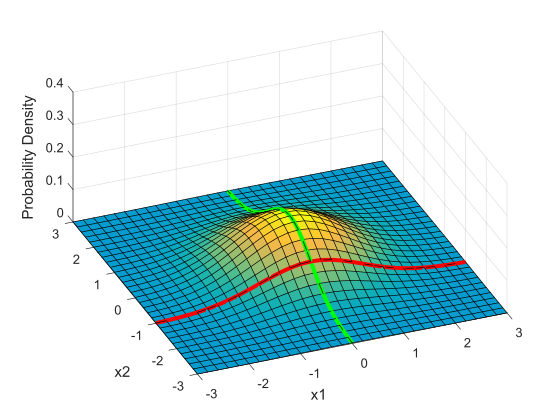
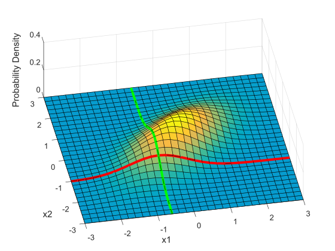
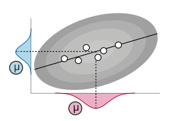

```{julia}
#| echo: false
using CairoMakie, AlgebraOfGraphics, SwarmMakie
using DataFrames, DataFramesMeta
using CategoricalArrays
using MixedModels, MixedModelsSim, Random, Distributions
using LinearAlgebra, StatsBase, GLM

# Global theme settings
set_theme!(Theme(
    fontsize = 18,
    font = "Helvetica",
))

nboot = 200;
```


# Slides & my Presentation style


<a href="?showNotes=true">Click this link to add notes to the slides</a>

<small>
this adds  `?showNotes=true` to the file
</small>


You can download the pdf or print them yourself:

<a href="?print-pdf"> click this link for pdf printable (use google chrome)</a>

<a href="?print-pdf&showNotes=true"> click this link for pdf printable + notes</a>


HTML is best viewed in chrome

<aside class="notes">
Notes are on :)
</aside>


# Why repeated measures?
## Repeated measures

```{julia}
#| echo: false
#| fig-width: 8

Random.seed!(1)
sd_within = 10
sd_effect = 4
effect = 2
subjects = 15

dat = DataFrame(subject=1:subjects, group=1, response=randn(subjects) .* sd_within .+ 30)
dat = vcat(dat,
    DataFrame(subject=1:subjects, group=2, response=dat.response .+ randn(subjects) .* sd_effect .+ effect)
)
dat.group = string.(dat.group)

data(dat) * mapping(:group, :response) * visual(Scatter; markersize=4) |> draw
current_figure()
```
It looks like there is no difference between groups?

But what if we have data from within the same subjects?


## Repeated measures

```{julia}
#| echo: false
#| fig-width: 8

Random.seed!(1)
conn = DataFrame(subject=string.(dat.subject), group=dat.group, response=dat.response)

datDiff = DataFrame(difference=dat.response[dat.group.=="2"] .- dat.response[dat.group.=="1"])

data(dat) * mapping(:group, :response) * visual(Scatter; markersize=4) |> draw
data(conn) * mapping(:group, :response, color=:subject) * visual(Lines) |> x->draw!(current_axis(), x)
current_figure()

```
<aside  class="notes">
Each subject is measured in multiple conditions. This allows us to remove individual offsets. Think of an extreme example. One subject has a score in one condition of 1000 and the other condition of 1001. A second subject a score of 10 and 11. The difference between conditions is 1 for both subjects. But if we would assume the data came from four separate subjects, we have to calculate the variance over [10 1000] and [1001 11]. Taking into account repeated measures can remove a lot of distracting effects/variances.
</aside >

## Individual differences

```{julia}
#| echo: false
#| fig-width: 8

data(datDiff) * mapping(:difference) * histogram(bins=20) |> draw
```
Between-Subject variability can be removed by repeated measures. This can result in higher power!


<aside  class="notes">
This plot shows the difference, e.g. condition2-condition1 for each subject. This difference values would commonly be tested with a t-test against an assumed $H_0=0$. Note that a paired t-test does the same, first calculate the difference and then test this against 0.
</aside >

## Accounting for repeated measures? {.smaller}

```{julia}
#| echo: false

Random.seed!(1)
level2 = randn(5) .* 5
level1 = DataFrame()
for (j, m) in enumerate(level2)
    tmp = DataFrame(trial=1:15, subject=j, response=randn(15) .+ m)
    global level1 = vcat(level1, tmp)
end

subjectMean = combine(groupby(level1, :subject), :response => mean => :resp_mean)
subjectSD   = combine(groupby(level1, :subject), :response => std => :resp_sd)

totalSubjectMean = mean(subjectMean.resp_mean)
totalSubjectSDwithin = mean(subjectSD.resp_sd)
totalSubjectSDaccross = std(subjectMean.resp_mean)

totalMean = mean(level1.response)
totalSD = std(level1.response)

x = range(-15, 15, length=101)
df = vcat(
    DataFrame(x=x, y=pdf.(Normal(totalSubjectMean, totalSubjectSDaccross/sqrt(5)), x), type="Samplingdistribution of subject-means"),
    DataFrame(x=x, y=pdf.(Normal(totalMean, totalSD/sqrt(length(level1.response))), x), type="Samplingdistribution of data-points"),
    DataFrame(x=x, y=pdf.(Normal(totalMean, totalSD), x), type="estimated Population dissaggregate"),
    DataFrame(x=x, y=pdf.(Normal(totalSubjectMean, totalSubjectSDaccross), x), type="estimated Population aggregate first")
)
df.y ./= maximum(df.y, dims=1);
```

```{julia}
#| echo: false
#| fig-width: 8


f,ax,h = scatter(level2,zeros(length(level2)),markersize=15,color=:black)
# Subject means as black points
#data(subjectMean) * mapping(:resp_mean) * visual(Scatter) |> x->draw!(current_axis(), x)
# Mean line
vlines!([mean(subjectMean.resp_mean)], color=:black, linewidth=2)
hideydecorations!(ax)
ylims!(-0.03,0.3)
hidespines!(ax)
f
```

$n_S=5$ subjects 


## Sampling distributions

```{julia}
#| echo: false
#| fig-width: 8

_df =  df[df.type .=="Samplingdistribution of subject-means",:]
_df.y = _df.y ./ max(_df.y)
lines!(_df.x,_df.y,color=:purple)

current_figure()
```

<aside  class="notes">
The sampling distribution represents the distribution of mean values we would get, if we would repeatedly sample new data (in this case samples with n = 5) from the population. Because we usually do not know the population sample mean, we have to estimate it from our current sample. In this example, we only have 5 data points, thus many population-means seem likely and the sampling distribution is broad.
</aside >


## Multiple trials per subject

```{julia}
#| echo: false
#| fig-width: 8
level1.y = rand(size(level1,1)).*0.05

f,ax,h = scatter(level2,zeros(length(level2)),markersize=15,color=:black)

data(level1) * mapping(:response,:y,color=:subject) * visual(Scatter) |> x->draw!(current_axis(), x)
# Mean line
vlines!([mean(subjectMean.resp_mean)], color=:black, linewidth=2)
hideydecorations!(ax)
ylims!(-0.03,0.3)
hidespines!(ax)

f
```
with $n_T =15$ trials
<aside class="notes">
But what if I tell you that we actually have multiple trials per this black datapoints? Does the situation change?
</aside>

## Sampling distributions

```{julia}
#| echo: false
#| fig-width: 8
_df =  df[df.type .=="Samplingdistribution of data-points",:]
_df.y = _df.y ./ max(_df.y)
lines!(_df.x,_df.y./5)


f
```
This sampling distribution reflects these exact 5 subjects. But does not generalize!

<aside  class="notes">
The sampling distribution is much smaller now, assumed we forgot that the data arose from the same subjects.
</aside >


## Sampling distributions

```{julia}
#| echo: false
#| fig-width: 8

_df =  df[df.type .=="Samplingdistribution of subject-means",:]
_df.y = _df.y ./ max(_df.y)
lines!(_df.x,_df.y,color=:purple)

f
```
<small>(<span style="color:#F660AB">pink</span> for aggregate, <span style="color:#7D0552">purple</span> for disaggregate).
There is a strong allure to choose the smaller one, easier to get significant results! </small>

$$n_{subject}(aggregate) = df+1 = 5$$
$$n_{subject}(pseudoreplication) = df+1= 15*5 = 75$$

**Never analyze repeated measures data without taking repeated measures into account** (Disaggregation, Pseudoreplication).

<aside class="notes">
The $n_{subject}$ are interesting because they directly relate to the sampling distribution ($SE =\frac{\sigma}{\sqrt n}$) that is, the higher the estimated number of subjects (or related, degree of freedoms), the smaller the SE, the more "sure" we are.

Taking the student t-test formula, it should become clear, that increasing N, will increase the t-value
$t=\frac{\mu}{\frac{\sigma}{\sqrt n}}$
</aside>


## Always necessary to aggregate?
:::: {layout-ncol=2}
::: {column}

```{julia}
#| echo: false
#| fig-height: 4

function genDat(sd1, sd2; plotDist=false)
    Random.seed!(3)
    level2 = randn(15) .* sd1
    level1 = []
    for (j, m) in enumerate(level2)
        tmp = DataFrame(trial=1:15, subject=j, response=randn(15) .+ m)
         push!(level1, tmp)
    end
    level1 = vcat(level1...)
    meanDat = combine(groupby(level1, :subject), :response => mean => :m)
    
    fig = Figure(size=(500, 300))
    ax = Axis(fig[1,1], yticks=[], xlabel="")

    data(level1) * mapping(:response, color=:subject) * visual(Scatter) |> draw
    #data(meanDat) * mapping(:m) * visual(Scatter) |> x->draw!(current_axis(), x)
    
    if plotDist
        ## Add density lines if requested
    end
    ylims!(current_axis(),-50,60)
    return (level1, current_figure())
end

(d1, fig1) = genDat(0.1, 3)
current_figure()
```
$$\sigma_{within} >> \sigma_{between}$$

Subjects are very **similar**

**Not so necessary to aggregate first**

A single parameter summarizes subject-means well

:::
::: {column}

```{julia}
#| echo: false
#| fig-height: 4

(d2, fig2) = genDat(25, 3)
current_figure()
```
$$\sigma_{within} << \sigma_{between}$$

Subjects are very **different**

**Totally necessary to aggregate first**

$n_{subject}$ parameters summarizes subject-means well
:::
::::


<aside  class="notes">
If all subjects are equal, e.g. you record a dice-throw of each number, you can forget about which subject threw which dice. That is, the variance subjects generate is much smaller than the variance of the outcome.

If subjects are quite different, you have to include this in your analysis. Mixed models are one way to account for the dependency/clusteredness of some measurements (dependency, because knowing 90% of samples of a single subject will inform you on the last 10% of that subject, but not as much of the other subjects, stronger in the "subjects are different" case)
</aside >


## Should we trust all subjects equally?


```{julia}
#| echo: false
#| fig-width: 8

Random.seed!(1)
sd1 = 0.01
sd2 = 10
level2 = randn(15) .* sd1
level1 = DataFrame()
for k in 1:15
    n_trial = ceil(Int, rand(1:6))^3
    tmp = DataFrame(trial=1:n_trial, subject=string(k), response=randn(n_trial) .* sd2 .+ level2[k])
    global level1 = vcat(level1, tmp)
end

data(level1) * mapping(:subject, :response, color=:subject) * visual(Beeswarm; algorithm=:pseudorandom) |> draw
subj_means = combine(groupby(level1, :subject), :response => mean => :m)
data(subj_means) * mapping(:subject, :m) * visual(Scatter; markersize=6, color=:black) |> x->draw!(current_axis(), x)
current_figure()
```

**Question:** Estimate the mean of the population

<aside  class="notes"> Subjects with low number of samples should be less reliable. Again think of the sampling distribution. In this case the first subjects will show a broad sampling distribution and should not be weighted as much, the last subjects should show a small distribution and should be weighted more</aside >

## Should we trust all subjects equally?

```{julia}
#| echo: false
#| fig-width: 8

current_figure()
```

We should take into account **sample-size** into our estimate of the population mean

We should trust those subjects more, where we most sure about their central tendency


## Summary

- **Why repeated measures**
    - More power to find effects that exist!
- **Don't forget about repeated measures!**
    - Else your type I error will be very high
- **Should we trust all subjects equally?**
    - No, we should punish for small within-subject sample-size and punish high variance


<aside  class="notes">At this point it should be said, that this dependency is NOT special to subjects. Imagine you measure how well different classes of a school do. Now again, you have dependent measures because you can test in each class multiple times (because there are students in there). The first conclusion is that dependencies can arise from many different things. usually it is helpful to think hierarchical. The school example could be increase in both dimensions: Questions - Students - Class - School - District - Nation  etc. We will soon learn how to incorporate all this knowledge in the model.

A second point is, repeated measures allow us to remove variance which is great! But standard approaches do not work anymore and might make us TOO confident. Nevertheless if the experimental design allows it, always try to do repeated measures.</aside >

# New section

## The example


```{julia}
#| echo: false

# --- Simulate EEG data using MixedModelsSim.jl ---
# Based on https://github.com/mbjoseph/hierarchical_models
rng = MersenneTwister(2)
J = 20  # number of subjects

# Build subject design with unequal trials (2–30)
n_j =rand(rng,2:30,J)
d = []
for i in 1:J
    push!(d,DataFrame(trial=1:n_j[i],subject=string(i)))
    
end

d = vcat(d...)

# Add predictor
rng2 = MersenneTwister(3)
d.contrast = rand(rng2, nrow(d)) .* 100

# Model parameters
mu_intercept = 3.0
sigma_intercept = 3.0
mu_slope = 0.1
sigma_slope = 0.1
sigma_y = 7.0

# Fit a null model to set up the structure
d.p100 = randn(nrow(d))  # placeholder
mnull = lmm(@formula(p100 ~ 1 + contrast + (1 + contrast | subject)), d)

# Build random-effects Cholesky factor (relative to residual σ)
# Intercept σ = 3/7, Slope σ = 0.1/7 (relative to σ=7)
re_subj = create_re(sigma_intercept/sigma_y , sigma_slope/sigma_y)

# Get θ and fixed effects
θ_eeg = createθ(mnull; subject=re_subj)
β_eeg = [mu_intercept, mu_slope]

# Simulate response using parametric bootstrap (1 replication gives us 1 dataset)
#sim_eeg = parametricbootstrap(MersenneTwister(42), 1, mnull;
#                              β=β_eeg, σ=sigma_y, θ=θ_eeg)
simulate!(mnull;β=β_eeg, σ=sigma_y, θ=θ_eeg)
# Extract simulated response from the bootstrap
d.p100 = mnull.y#sim_eeg[1].y

# Fit the final mixed model
mres = lmm(@formula(p100 ~ 1 + contrast + (1 + contrast | subject)), d)
```



EEG-Experiment: Contrast vs. P100 size

=> Very noisy subjects (babies?), between $(minimum(n_j))$ and $(maximum(n_j))$ trials
<aside  class="notes"> We will use an somewhat realistic example based on EEG data. Imagine you want to perform a psycho-physical experiment elucidating on the relation between brain response (the P100 ERP/EEG response) and the contrast of your favorite stimulus. In the experiment you show the stimulus with a given contrast (randomly chosen*) and record the response (P100 amplitude). Because your subjects are babies, they will quit the experiment at various points in time. Also their data will be quite noisy due to movement and other inattention effects.

* of course randomly choosing the contrast is quite sub-optimal, but for the sake of the explanation...)
</aside >

## The data


```{julia}
#| echo: false
#| fig-width: 8
#| fig-height: 4

data(d) * mapping(:contrast, :p100, color=:subject,layout=:subject) * visual(Scatter) |> draw

```

<aside  class="notes">Each subplot represents one baby. You can see that some babies have many trials, some only a few. </aside >


## One model for all subjects


```{julia}
#| echo: false
#| fig-width: 8
#| fig-height: 4

co = coef(lm(@formula(p100 ~ 1 + contrast), d))
df_fit = DataFrame(contrast=1:100, p100=co[1] .+ co[2] .* (1:100))

data(d) * mapping(:contrast, :p100, color=:subject) * visual(Scatter) |> draw
data(df_fit) * mapping(:contrast, :p100) * visual(Lines; color=:gray) |> x->draw!(current_axis(), x)
current_figure()
```
$$\hat{y} = \beta_0 + \beta_1 * contrast $$
<aside  class="notes">If we would fit only a single model to all data points (disregarding subject-dependencies), it would look like this. This would need the assumption, that all data is actually coming from the same process. In other words: there is no difference between babies.</aside >

## One model for each subject

```{julia}
#| echo: false
#| fig-width: 8
#| fig-height: 4

# Fit individual models
coefs = DataFrame()
for s in levels(d.subject)
    sd = d[d.subject .== s, :]
    m = lm(@formula(p100 ~ 1 + contrast), sd)
    c = coef(m)
    coefs = vcat(coefs, DataFrame(subject=s, term=["(Intercept)","contrast"], estimate=[c[1], c[2]]))
end

# Build individual fit lines
fitIndi = DataFrame()
for s in levels(d.subject)
    sc = coefs[coefs.subject .== s, :]
    intercept_s = sc.estimate[sc.term .== "(Intercept)"][1]
    slope_s = sc.estimate[sc.term .== "contrast"][1]
    cf = DataFrame(subject=s, contrast=1:100, p100=intercept_s .+ slope_s .* (1:100))
    fitIndi = vcat(fitIndi, cf)
end

# Get random effects from mixed model
re = ranef(mres)
fe = fixef(mres)
fitRan = DataFrame()
for (idx, s) in enumerate(levels(d.subject))
    u0 = re[1][1,idx]
    u1 = re[1][2,idx]
    cf = DataFrame(subject=s, contrast=1:100,
                   p100=(fe[1] .+ u0) .+ (fe[2] .+ u1) .* (1:100))
    fitRan = vcat(fitRan, cf)
end

co = coef(lm(@formula(p100 ~ 1 + contrast), d))
df_fit = DataFrame(contrast=1:100, p100=co[1] .+ co[2] .* (1:100))

data(d) * mapping(:contrast, :p100) * visual(Scatter) |> draw
data(df_fit) * mapping(:contrast, :p100) * visual(Lines; color=:gray) |> x->draw!(current_axis(), x)
data(fitIndi) * mapping(:contrast, :p100, color=:subject) * visual(Lines) |> x->draw!(current_axis(), x)
current_figure()
```
$$\hat{y_j} = \beta_{0,j} + \beta_{1,j} * contrast $$
<aside class="notes"> The alternative extreme is to fit one model for each subject. An individual fit (each colored line). You can clearly see that subjects' individual fits are very different from each other and can be very different from the average model fit (gray). Let's look at the result of the subject in the lower right corner. It looks like that many different lines with many different slopes would fit the data equally well (or quite close). That is, there is a high uncertainty on the slope parameter. As discussed earlier, we should deemphasize this subject, that is, take into account our uncertainty. We will soon find a compromise between the two extremes, individual fits vs. complete pooled fit.
</aside>

## Excursion: two-stage statistics


```{julia}
#| echo: false

# Left plot: all individual fits
plt1 = data(fitIndi) * mapping(:contrast, :p100, color=:subject) * visual(Lines) |> draw
current_figure()

# Right plot: histogram of slope estimates + normal overlay
meanList = combine(groupby(coefs, :term), :estimate => mean => :m)
sdList = combine(groupby(coefs, :term), :estimate => std => :sd)

slope_estimates = coefs[coefs.term .== "contrast", :estimate]
slope_mean = meanList.m[meanList.term .== "contrast"][1]
slope_sd = sdList.sd[sdList.term .=="contrast"][1]

xseq = range(-0.5, 0.5, length=100)
norm_df = DataFrame(x=collect(xseq), y=pdf.(Normal(slope_mean, slope_sd), xseq))

fig = Figure(size=(500, 400))
ax = Axis(fig[1,1])

plt2 = data(DataFrame(estimate=slope_estimates)) * mapping(:estimate) * histogram(normalization=:density) |> draw
data(norm_df) * mapping(:x, :y) * visual(Lines; color=:blue, linewidth=2) |> x->draw!(current_axis(), x)
vlines!(ax, [slope_mean], color=:blue, linewidth=2, linestyle=:dash)
vlines!(ax, [0.0], color=:black, linewidth=2)

nothing;
```

:::: {layout-ncol=2}
::: {column}

```{julia}
#| echo: false
plt1
```

:::
::: {column}

```{julia}
#| echo: false

plt2
```
:::
::::

<aside  class="notes">This slide represents is a small excursion because it is **very** common in fMRI research and somewhat common in EEG. 

The left plot shows all individual subject fits in one single plot.  

It is statistically possible and accurate (but not as powerful as mixed models), to first summarize each subject (fit a model for each subject) and then test the model-parameters for systematic effects. The idea is, that if there is no effect of contrast (i.e. on the parameter slope), then the distribution of slope-parameters should be around zero (indicated by the black line in the right panel). If we find a deviation from 0 (right panel, blue dashed line) we can conclude that the subjects show a non-zero slope. Note that the first model (the individual fit) is usually referred to as the 1st level. The test of the parameters against 0 referred to as the 2nd-level (or group level). </aside >
   

# The LMM

## One solution


**Linear Mixed Model** aka **Hierarchical Model** aka **Multilevel Model**

We estimate the population distribution directly. Subject-means with high uncertainty are less influential for the model fit
<aside  class="notes">
The top distribution represents the (non-measurable) population. One can imagine, that each sampled subject represents one instance (random sample) of the population. If we have multiple trials per subject, than the game is repeated, each trial is one random sample of the subject distribution. We want to go in reverse direction, i.e. estimate from trial-wise measured data the subject means + variances and the population mean +variance
</aside>


## A compromise

:::: {layout-ncol=2}
::: {column}

```{julia}
#| echo: false
#| fig-height: 4

(d1a, fig1a) = genDat(0.1, 3)
current_figure()
```

Small second level variance (limit $0$)

Parameters/DF assumed to be n-trials

:::
::: {column}

```{julia}
#| echo: false
#| fig-height: 4

(d2a, fig2a) = genDat(25, 3)
current_figure()
```

Large second level variance (limit $\infty$)

Parameters/DF assumed to be subjects
:::
::::



<aside class="notes"> One can imagine this as the dial (=> a to-be-estimated parameter) of a tachometer. If the population     variance is very small (or $0$), all subjects are the same. We can pool over subjects. If the estimated population variance is very high ($\infty$) we have to treat each subject individual. Most of the time we will be in between. For experts: The degrees of freedom can therefore be uneven numbers!

An example for the left side would be, if you ask 50 subjects to flip a coin for 10times. You don't expect subjects to differ here. The right side would be, if all subjects are different, for example if you would ask 50 subjects to tell you the distance to their favorite vacation destination, I doubt you can use the answer of one subject ot inform the answer of other subjects very much.
</aside>


## Formal definition of the linear mixed model



<aside class="notes">
Coming back to the linear model, we assume that each parameter has a population distribution (Later we will relate two or more population distribution with each other). In order to later analyse the effects more easily, we use a specific definition:
Split up the mean of the population in a "grand-average" mean + individual subject deviations. E.g. $\hat{y} = (\beta_0+u_{0,subject}) + (\beta_1+u_{1,subject})\cdot contrast.  Assume that the subject deviations are around 0 and normally distributed (central limit theorem anyone?). If we rearrange the terms we reach the formula on the slide.
</aside>

## A word of warning

> Encouraging psycholinguists to use linear mixed-effects models 'was like giving shotguns to toddlers' (Barr)

<br>

> Because mixed models are more complex and more flexible than the general linear model, the potential for confusion and errors is higher (Hamer)

Many ongoing riddles:

[Book: Richly Parameterized Linear Models](http://www.biostat.umn.edu/~hodges/RPLMBook/RPLMBookpage.htm)

- Chp. 9: Puzzles from Analyzing Real Data sets
- Chp.10: A Random Effect Competing with a Fixed Effect
- Chp.12: Competition between Random Effects
- Chp.14: Mysterious, Inconvenient or Wrong Results from Real Datasets

<aside class="notes">
Mixed models can be complicated. I always try to draw the relation between parameters and explicitly write down the $y = \beta_0 + \beta_1*X ...$ formula. The link to the book serves just as an example that there can be many strange things going on when doing hierarchical models.
</aside>


## The mixed model in Julia

$\hat{y} = \beta_0 + \beta_1 * contrast + u_{0,j} + u_{1,j} * contrast$

$\hat{y}_j = \beta X_j + b_jZ$

Fitting this in Julia using the package **MixedModels.jl**

`@formula(p100 ~ 1 + contrast + (1 + contrast | subject))`


Note: In R::LME4 use `||` for uncorrelated random effects:
`p100 ~ 1 + contrast + (1 + contrast || subject))`


<aside class="notes">
Everything in brackets defines that it is nested in the grouping variable. For example (0+contrast|subject) means that contrast is nested in the grouping variable subject. But of course (0+contrast|school) or (0+contrast|image) could be groupings as well. Note that the 0+contrast is necessary and it will be later obvious why.
</aside>


## Mixed models in Julia

```{julia}
#| results: 'markup'

mres = lmm(@formula(p100 ~ 1 + contrast + (1+contrast | subject)), d)
print(summary(mres))
```
<aside class="notes">
This is the model summary output. The important bits are under "Random effects" and "Fixed effects". Random effects describes the variance component, fixed effects the mean components. We are usually interested in the "fixed effect" estimates (more to the names later). I.e. it is not so interesting how much subjects vary in their mean-effects, but on how large the effect is on average

(1 + contrast||subject) is equal to (1|subject) + (0+contrast|subject)
</aside>


```{julia}
#| echo: false
#| fig-width: 8
#| fig-height: 4

data(d) * mapping(:contrast, :p100) * visual(Scatter) |> draw
data(df_fit) * mapping(:contrast, :p100) * visual(Lines; color=:gray) |> x->draw!(current_axis(), x)
data(fitIndi) * mapping(:contrast, :p100, color=:subject) * visual(Lines) |> x->draw!(current_axis(), x)
data(fitRan) * mapping(:contrast, :p100) * visual(Lines; color=:black) |> x->draw!(current_axis(), x)
current_figure()
```

gray: one model, color: individual model, black: mixed model
<aside class="notes">
In our example, we see that the extreme results are not there anymore. For each subject a compromise was built between the average response and their individual ones.
</aside>

<!--
## Direct comparison of 2-stage vs mixed model

```{julia}
#| echo: false
#| fig-width: 8
#| fig-height: 4

# Get variance components from mixed model
vc = VarCorr(mres)
sd_mm =  vc.σρ[:subject][:σ]   #sqrt.(diag(vc[2:3, 2:3]))  # diagonal elements for intercept and slope

# Two-stage estimates
meanList = combine(groupby(coefs, :term), :estimate => mean => :m)
sdList = combine(groupby(coefs, :term), :estimate => std => :sd)

slope_mean_2stage = meanList.m[meanList.term .== "contrast"][1]
slope_sd_2stage = sdList.sd[sdList.term .== "contrast"][1]
slope_mean_mm = fixef(mres)[2]
slope_sd_mm = sd_mm[2]

xseq = range(-0.5, 1.0, length=100)
d_comparison = vcat(
    DataFrame(x=collect(xseq), y=pdf.(Normal(slope_mean_2stage, slope_sd_2stage), xseq), type="two stage"),
    DataFrame(x=collect(xseq), y=pdf.(Normal(slope_mean_mm, slope_sd_mm), xseq), type="mixed model")
)

data(d_comparison) * mapping(:x, :y, color=:type) * visual(Lines) |> draw
data(coefs[coefs.term .== "contrast", :]) * mapping(:estimate,1) * visual(Scatter) |> x->draw!(current_axis(), x)
current_figure()
```

two stage:
```{julia}
#| echo: false
#| results: 'markup'

m_2stage = lm(@formula(m ~ 1), DataFrame(m=coefs.estimate[coefs.term .== "contrast"]))
"  Estimate: $(coef(m_2stage)[1])   Std. Error: $(stderror(m_2stage)[1])"
```
mixed-model:
```{julia}
#| echo: false
#| results: 'markup'

fe = fixef(mres)
se = stderror(mres)
"  Estimate: $(fe[2])   Std. Error: $(se[2])"

``` 

true: slope=0.1
<aside class="notes">
The two stage model shows a slight bias to (in this example) smaller slope values (see "Estimate", 0.07 vs. 0.1). The mixed model is closer to the truth, because it can re-weight each sample based on their number of trials and their variances.
</aside>
-->


# Methods, Stats, etc. around LMMs

## REML VS ML

### Intuition:
When estimating the variance parameter using maximum likelihood (**ML**) $\sigma$ is biased because $\mu$ is not known at the same time

### Solution:
Fit all fixed effects $\mu$, then refit the variance parameters on the residing estimates.

This is called restricted maximum likelihood (**REML**). If $n$ is large, no difference between **ML** and **REML** exist. If $n$ (i.e. $n_{subjects}$) is small **REML** gives better predictive results.

<br>
If you do model comparison and fixed effects differ (usual case) you have to use **ML**. If ML-models were simplified using LRT, best practice to report the REML model at the end.
 

<aside class="notes">
For further details see Zuur 2009 ("Mixed Effects Models and Extensions in Ecology with R", page 116). In practice you do not need to worry too much about the difference. In MixedModels.jl, use `method=:ml` for ML and `method=:reml` (default) for REML.
</aside>


## Bootstrapping

- resample from the data with replacement (or parametrically from $H_0$-Model) $N$ times
- calculate statistic of interest
- observe spread of statistic

```{julia}
#| fig-height: 4
samp = parametricbootstrap(1_000,mres)

f,ax,h = CairoMakie.hist(samp.tbl.σ; axis=(xlabel="Parametric bootstrap estimates of σ₁",))
CairoMakie.hist(f[1,2],samp.tbl.β1; axis=(xlabel="Parametric bootstrap estimates of contrast",))
f

```
<aside class="notes">
Bootstrapping is a really nice tool. If I would not use Bayes, I would use bootstrapping. The downside is, that its computationally very expensive.
</aside>


## Model-Comparisons aka p-values

Unresolved problem!

Read (three links):
- [how to get p values](https://rdrr.io/cran/lme4/man/pvalues.html)
- [problems with stepwise regression](http://www.stata.com/support/faqs/statistics/stepwise-regression-problems/),
- [different ways to get p-values](http://glmm.wikidot.com/faq)

One way (good and common, but not the best*): Model comparison for fixed effects:

**Be sure to keep random structure equal**

```{julia}
#| echo: true
mres0 = lmm(@formula(p100 ~ 1 + (1+contrast | subject)), d)
mres1 = lmm(@formula(p100 ~ 1 + contrast + (1+contrast | subject)), d)
lrtest(mres0,mres1)
```
```{julia}
# Likelihood ratio test
#lr_stat = 2 * (loglikelihood(mres1) - loglikelihood(mres0))
#p_value = 1 - cdf(Chisq(1), lr_stat)

```


<aside class="notes">
In order to check whether a certain parameter/term leads to a better model fit, we can compare two models: One with that parameter (could be a fixed effect or random effect) and one without. The likelihood ratio test compares the log-likelihoods. We know from earlier lectures that the outcome of a likelihood ratio test punishes for more parameters, assuming assumptions are met, we can look up a probability that adding a parameter with no relation to the data will improve our model as much as the model got improved.
</aside>


## Wald confidence intervals

Simpler approach: Wald-based confidence intervals

```{julia}
#| echo: true
summary(mres1)
```

```{julia}
#| echo: true
confint(mres1)
```
Wald confidence intervals are **approximate** but computationally efficient.

**For small samples please consider other methods!**

<aside class="notes">
MixedModels.jl provides profile likelihood confidence intervals which are more accurate than Wald-based intervals. The book from Phillip Good: "Permutation, Parametric and Bootstrap Tests of Hypotheses" might be a good start to learn more.
</aside>

## Degrees of Freedom
### Why wald is approximate?
Some packages (e.g. `R::lme4`) refuse to provide p-values, because the "degree of freedom" are not defineable.

Are they $n_{subject}$? Is it $n_{total-trials}$? Somewhere in between?

Each method to make a decision (e.g. Wald's, Bootstrap, MCMC, Profiling, Permutation) makes some kind of assumption on this.



## Kenward Roger / Satterthwaite
```{julia}
#| echo: true
using MixedModelsSmallSample
mres1_reml = lmm(@formula(p100 ~ 1 + contrast + (1+contrast | subject)), d;REML=true)
kr = small_sample_adjust(mres1_reml,KenwardRoger())
sw = small_sample_adjust(mres1_reml,Satterthwaite())

coeftable(mres1_reml)
```
```{julia}
#| echo: true
coeftable(kr)
```
```{julia}
#| echo: true
coeftable(sw)
```

# Assumption checking
## Checking Assumptions Level I

```{julia}
#| echo: false

mres = fit(MixedModel,@formula(p100 ~ 1 + contrast + (1 + contrast | subject)), d)
```
:::: {layout-ncol=2}
::: {column}

```{julia}
#| echo: false

resid = residuals(mres)
n = length(resid)

fig = Figure(size=(400, 300))
ax = Axis(fig[1,1])

data(DataFrame(x=1:n, res=resid)) * mapping(:x, :res) * visual(Scatter) |> draw
# Add smooth line
xs = 1:n
ys = resid
# Simple moving average
window = 5
ys_smooth = [mean(ys[max(1,i .- window):min(n,i .+ window)]) for i in 1:n]
data(DataFrame(x=xs, y=ys_smooth)) * mapping(:x, :y) * visual(Lines; color=:red) |> x->draw!(current_axis(), x)

current_figure()
```

No strong non-linearity visible in residuals

:::
::: {column}

```{julia}
#| echo: false

# QQ plot of residuals
resid = residuals(mres)
sorted_resid = sort(resid)
theoretical_quantiles = quantile.(fill(Normal(0,1), length(sorted_resid)), ((1:length(sorted_resid)) .- 0.5) ./ length(sorted_resid))

# Fit line
q_sample = quantile(resid, [0.25, 0.75])
q_theory = quantile(Normal(0,1), [0.25, 0.75])
slope_qq = diff(q_sample)[1] / diff(q_theory)[1]
intercept_qq = q_sample[1] - slope_qq * q_theory[1]

fig = Figure(size=(400, 300))
ax = Axis(fig[1,1], xlabel="Theoretical Quantiles", ylabel="Sample Quantiles")

data(DataFrame(x=theoretical_quantiles, y=sorted_resid)) * mapping(:x, :y) * visual(Scatter) |> draw
qq_line_y = intercept_qq .+ slope_qq .* theoretical_quantiles
data(DataFrame(x=theoretical_quantiles, y=qq_line_y)) * mapping(:x, :y) * visual(Lines; color=:red) |> x->draw!(current_axis(), x)

current_figure()
```

QQ plot indicates normality of residuals
:::
::::

## Checking assumptions Level II

In addition: test whether normality for random-variable is true:
```{julia}
#| echo: false
#| fig-width: 8
#| fig-height: 2

# Extract random effects
re = ranef(mres)[1]

# QQ plots for each random effect
re_names = [:"(Intercept)", :contrast]
fig = Figure(size=(800, 600))

for (idx, name) in enumerate(re_names)
    ax = Axis(fig[1, idx]; xlabel="Theoretical", ylabel="Sample", title=string(name))
    vals = sort(re[idx,:])
    n = length(vals)
    theo = quantile.(fill(Normal(0,1), n), ((1:n) .- 0.5) ./ n)
    q_s = quantile(vals, [0.25, 0.75])
    q_t = quantile(Normal(0,1), [0.25, 0.75])
    sl = diff(q_s) / diff(q_t)
    sl = sl[1]
    ic = q_s[1] .- sl .* q_t[1]

    scatter!(ax, theo, vals)
    lines!(ax, theo, ic .+ sl .* theo)
end

current_figure()

# Histograms + density
for (idx, name) in enumerate(re_names)
    ax = Axis(fig[2, idx]; title=string(name))
    vals = re[idx,:]
    fit = fit_mle(Normal, vals)
    hist!(ax, vals, normalization=:pdf)
    xs = range(minimum(vals), maximum(vals), length=100)
    lines!(ax, xs, pdf.(fit, xs))
end

current_figure()
```

QQ plot indicates normality of random effects, potentially some outliers on hte left side

# Shrinkage

## Shrinkage


The individual estimates with high variance / far off the population are *shrinked* inwards

<aside class="notes">
Shrinkage is also sometimes referred to as partial-pooling. Complete pooling would mean ignoring subject/group structure => all subjects are the same, no pooling would mean each subjects is fitted individually.

A very useful thing of shrinkage gets obvious, when we think outside of the context of experiments. Imagine you try to estimate the deadliness of a certain cancer for all districts of Germany. Because the cancer is quite rare, in some less-populated districts it can happen that there is no cancer and thus by necessity no-one died. In other districts it might be that one person got cancer and died. Take the mean of Germany to be 1% rate and 0.2% died. These first two districts have a 0% death-rate and a 100% death-rate respectively. It seems fair to include the information on rate / death rate of all other districts (Germany) to make better predictions on the actual (not the direct observed) rate.
</aside>


## Shrinkage-plot

```{julia}
using MixedModelsMakie
shrinkageplot(mres)
```

<aside class="notes">
Each dot is an estimate of a single subject. The blue dots are after using the mixed model, the reds ones the individual fits.
</aside>


```{julia}
#| echo: false
#| fig-width: 8
#| fig-height: 4

data(d) * mapping(:contrast, :p100) * visual(Scatter) |> draw
data(df_fit) * mapping(:contrast, :p100) * visual(Lines; color=:gray) |> x->draw!(current_axis(), x)
data(fitIndi) * mapping(:contrast, :p100, color=:subject) * visual(Lines) |> x->draw!(current_axis(), x)
data(fitRan) * mapping(:contrast, :p100) * visual(Lines; color=:black) |> x->draw!(current_axis(), x)
current_figure()
```

gray: one model, color: individual model, black: mixed model (with shrinkage)
<aside class="notes">
The subjects which are shrinked the most are the ones with the least amount of data / highest variance.
</aside>


## Shrinkage over multiple parameters

```{julia}
#| echo: false
#| fig-width: 8
#| fig-align: "center"

rng_shrink = MersenneTwister(110)

# Parameters for shrinkage example
n_subj_shrink = 10
tr = 50
con = 600
c_var = 100^2
beta = 50.0
beta_var = 15^2
within_var = 10.0

ρ = -0.8

# Build design with subjects and trials
trial_ids = Int[]
subj_ids = String[]
diff_vals = Float64[]
for sub in 1:n_subj_shrink
    append!(trial_ids, 1:tr)
    append!(subj_ids, fill(string(sub), tr))
    append!(diff_vals, rand(rng_shrink, tr) .* 5)
end
allDat = DataFrame(trial=trial_ids, subject=subj_ids, difficulty=diff_vals)


# Model parameters (relative to residual σ = within_var)
σ_intercept = c_var / within_var^2
σ_slope = beta_var / within_var^2


β_shrink = [con, beta]

# Fit null model to get structure
allDat.y = randn(nrow(allDat))
m_shrink = lmm(@formula(y ~ 1 + difficulty + (1 + difficulty | subject)), allDat)

θ_shrink = create_re(σ_intercept,σ_slope;corrmat=[1 ρ;ρ 1])

# Simulate data
simulate!(m_shrink; β=β_shrink, σ=within_var, θ=createθ(m_shrink;subject=θ_shrink))
allDat.y = m_shrink.y

# Add sub_c and sub_b columns (from random effects) for downstream use
re_fits = ranef(m_shrink)

data(allDat) * mapping(:difficulty, :y) * visual(Scatter; alpha=0.3) |> draw
data(allDat) * mapping(:difficulty, :y, color=:subject) * linear() |> x->draw!(current_axis(), x)
current_axis().title="@formula(y ~ 1 + diff + (1 + diff | subject))"
current_figure()
```

**Simulated data**: Subjects with faster reaction time (intercept) show larger effects for difficulty (slope)

In reverse: If I know somebody is generally slow, he should also have a smaller slope!


<aside class="notes">
Here, multiple parameters (two parameters) refer to having an intercept and a slope. But correlation between two effects can also occur for more than two variables (as discussed later). What happens if we don't do this? This would mean, that each predictor explains unique information, i.e. they are independently predictive. But in our example they clearly are not. Knowing about the average reaction time already tells you something about the other effect.
</aside>


## The multivariate normal I

<iframe scrolling="no" class="stretch" width="1900px" height="1900px" src="https://www.geogebra.org/material/iframe/id/pO4JcWPz/width/1600/height/969/border/888888/smb/false/stb/false/stbh/false/ai/false/asb/false/sri/false/rc/false/ld/false/sdz/false/ctl/false" style="border:0px;"> </iframe>

<aside class="notes">
We move around the multivariate normal distribution to get an intuition what the different parameters do

</aside>


## The multivariate normal II

:::: {layout-ncol=2}

::: {column}


$\rho = 0$, knowing one dimension does not tell you about the other


$$\sum  =  \left[ {\begin{array}{*{20}{c}}
1&0 \\
0 &1
\end{array}} \right]$$

:::
::: {column}


$\rho = 0.6$, knowing one dimension tells you something about the other


$$\sum  =  \left[ {\begin{array}{*{20}{c}}
1&0.6 \\
0.6 &1
\end{array}} \right]$$
:::
::::

<aside class="notes">
A multivariate normal is defined by a vector of means and a covariance matrix ($\sigma$). Here I depict two different cov-matrices. Imagine you measure X_2, then in the right panel you know that X_1 is distributed along the red line, with larger values meaning that it is more probable to observe X_1 there. In the left panel, it does not help us to know anything about X_2 to predict X_1. Regardless of where the red line would cross the distribution, the maximal likely value does not change.
</aside>


## Back to mixed models

:::: {layout-ncol=2}
::: {column}



$$\sum  =  \left[ {\begin{array}{*{20}{c}}
1&\rho \\
\rho &1
\end{array}} \right]$$

:::
::: {column}

```{julia}
#| echo: false
#| fig-width: 8
#| fig-height: 4

data(allDat) * mapping(:difficulty, :y) * visual(Scatter; alpha=0.3) |> draw
data(allDat) * mapping(:difficulty, :y, color=:subject) * linear() |> x->draw!(current_axis(), x)
current_figure()
```
:::
::::

<aside class="notes">
The left plot again shows the multivariate normal of the parameters (e.g. intercept vs slope). The right plot the actual data. I hope the relation between the two plots became clear. Please note, that the two images do not fit to each other. The sketch on the left should have a tilde downward (a negative correlation!)

In the mixed model context we can add this correlation value, i.e. we try to estimate how much the two factors are correlated with each other. Take care, usually this is very difficult to estimate and you need lots of data on the second level! Estimating variances already is difficult, correlations much more so.
</aside>


## Naming is a bit messy

:::: {layout-ncol=2}

::: {column}

**Random/Fixed Coefficients**
  - **Random intercept**
     - `(1 | subject)`: Different offset for each subject
  - **Random slope**
     - `(predictor | subject)`: Different predictor-slope for each subject
  - **Random correlation**
     - `(1 + predictor | subject)` or `(X + Y | subject)`: Knowing about X tells you something about Y
  - **Fixed coefficient**
     - exactly the same for all subjects

:::

::: {column}

**Random/Fixed Variables**s
  - **Random variable**
     - Instance $\in$ population, e.g. subjects, images, words
  - **Fixed variable**
     - limited number of possible values or no generalization to population needed, e.g. 3 different experimental conditions


*Random effect* also used for either *random coefficient* or *random variable*

*Fixed effect* usually refers to the estimator of the population mean

[source](web.pdx.edu/~newsomj/mlrclass/ho_randfixd.pdf) and another 5 [different definitions here](http://andrewgelman.com/2005/01/25/why_i_dont_use/)

:::
::::

<aside class="notes">
This mix of terminology is unfortunate. The first divide is between coefficients and variables, they describe very different things. Then the difference between fixed/random coefficients is less clear. Most often the question "should I model this as a random effect" relates to Random Variable vs. "Fixed Variable".
</aside>


# Convergence & Singularity

## A more complex model
```{julia}
#| echo: false

d.contrastSquare = d.contrast .^ 2

try
    m_complex = lmm(@formula(p100 ~ 1 + contrast + contrastSquare + (1 + contrast + contrastSquare | subject)), d)
    print(summary(m_complex))
catch e
    println("Convergence warning: ", e)
end
```

**Common warnings:**
- Predictor variables on very different scales: consider rescaling
- Model failed to converge: degenerate Hessian with negative eigenvalues

<aside class="notes">
Often, when using a more complex model, the model fit does not converge. We will have a look next on what to do then.
</aside>


## Convergence vs. Singularity problems


### Convergences
- Real convergence problems are rare in R::lme4, and extremely rare in MixedModels.jl
- Typically the objective function is extremely flat and the optimizer struggles => change optimizer, change data (outliers?), missspecifications
- Center predictors (remove mean) and scale (divide by SD of independent variable)
### Singularity
**Most common issue** is singular fits

#### How to Spot?
 -1/+1/0 in variance estimation

#### Why?
You don't have enough data to estimate the random effects structure

#### How to fix?
Different opinions:
1) "Keep it maximal" - nothing to do, just use as is
2) "Simplify" - simplify until non-singular


## The ideal case

$$ \sum  = \left[ {\begin{array}{*{20}{c}}
1&{{\rho_{ab}}}&{{\rho_{ac}}}&{{\rho_{ad}}}\\
{{\rho_{ab}}}&1&{{\rho_{bc}}}&{{\rho_{bd}}}\\
{{\rho_{ac}}}&{{\rho_{bc}}}&1&{{\rho_{cd}}}\\
{{\rho_{ad}}}&{{\rho_{bd}}}&{{\rho_{cd}}}&1
\end{array}} \right]$$

``@formula(y ~ 1 + A + B + C + (1 + A + B + C | group))``

If you have enough data, try to estimate all correlations.
<aside class="notes">
This model has very many parameters. See that there is a combinatorial explosion, adding one more effect will result in n-coefficients - 1 new correlations!

As a side note: it is also possible have correlation matrices, where some effects covary and others do not.
</aside>


## The simplest structure
:::: {layout-ncol=2}
::: {column}

$$\Sigma  = \left[ {\begin{array}{*{20}{c}}
1&0&0&0\\
0&1&0&0\\
0&0&1&0\\
0&0&0&1
\end{array}} \right]$$

<small> ``@formula(y ~ 1 + X1 + X2 + X3 + zerocorr(1 + X1 + X2 + X3 | group))``</small>


<small> R::LME4 ``formula y ~ 1 + X1 + X2 + X3 + (1 + X1 + X2 + X3 || group)``</small>

note the `||` instead of `|`

:::
::: {column}


$$\Sigma  = \left[ {\begin{array}{*{20}{c}}
1&{{\rho _a}}&{{\rho _a}}&{{\rho _a}}\\
{{\rho _a}}&1&{{\rho _a}}&{{\rho _a}}\\
{{\rho _a}}&{{\rho _a}}&1&{{\rho _a}}\\
{{\rho _a}}&{{\rho _a}}&{{\rho _a}}&1
\end{array}} \right]$$

Compound symmetry $\simeq$ Repeated measures ANOVA

<small> ``@formula(y ~ 1 + X1 + (1 | group) + (1 | group:X1))`` </small>

:::
::::
<aside class="notes">
The left side shows the very strong assumption, that all effects are uncorrelated to each other. This is usually not the case, try to avoid (except in the very rare situation its the correct model). The right one can be used more often, the specification might be unclear.
</aside>

## Which one to choose?

- 1: You can estimate the full (enough data or put a LKJ-prior if you are Bayesian)
- 2: Prior assumption on shape and you don't have to change it (non-contingent on data)
- 3: Simplify in a data-driven way

Ongoing debate ["Keep it maximal", Barr et al. 2013](https://www.ncbi.nlm.nih.gov/pmc/articles/PMC3881361/) vs. ["Parsimonious mixed models", Bates et al. 2015](https://arxiv.org/abs/1506.04967) and ["Balancing Type I error and power in linear mixed models", Matuschek et al. 2017](10.1016/j.jml.2017.01.001)

Barr promotes full models. Bates/Matuschek promotes a step wise reduction if effects do not significantly explain variance

<aside class="notes">
Remember the problems of step-wise procedures. There is currently a long debate and no solution - sorry!
</aside>


## A clarification to simplification

Often people simplify like this:
`y ~ 1 + X * Y + (1 + X * Y | group)`
`y ~ 1 + X * Y + zerocorr(1 + X * Y | group)`
`y ~ 1 + X * Y + zerocorr(1 + X + Y | group)`
`y ~ 1 + X * Y + zerocorr(1 + X | group)`
`y ~ 1 + X * Y + (1 | group)`

But if your hypothesis is on the interaction of `X&Y`, (following Matuschek) you should rather

`y ~ 1 + X * Y + (1 + X * Y | group)`
`y ~ 1 + X * Y + zerocorr(1 + X * Y | group)`
`y ~ 1 + X * Y + zerocorr(1 + X + X&Y | group)`
`y ~ 1 + X * Y + zerocorr(1 + X&Y| group)`
`y ~ 1 + X * Y + (0 + X&Y | group)`

i.e. keep the random slopes for the effect you are most interested in the longest.


# Item effects


## Multiple random variables
```{julia}
#| echo: false

rng_mm = MersenneTwister(2)

# Use MixedModelsSim to create a crossed design (subjects × stimuli)
n_subj = 30
n_stim = 30
both_win = Dict(:condition => ["A", "B"])

design_crossed = simdat_crossed(rng_mm, n_subj, n_stim; both_win=both_win)
dat2 = DataFrame(design_crossed)
dat2.subject = categorical(dat2.subj)
dat2.stimulus = categorical(dat2.item)
dat2.condition = Int.(dat2.condition .== "B")

# Model parameters
σ_err = 3.0
σ_subj_intercept = 3.0
σ_subj_slope = 1.0
σ_stim_intercept = 10.0
σ_stim_slope = 1.0
β_fixed = [1.0, 0.0] 

# Fit null model to get structure
dat2.dv .= randn(nrow(dat2))
m_crossed = fit(MixedModel, @formula(dv ~ 1 + condition + (1 + condition | subj) + (1 + condition | item)),
                dat2; contrasts=Dict(:condition => EffectsCoding(base=0)))

# Random effects (relative to residual σ)
re_subj_crossed = MixedModels.LowerTriangular([σ_subj_intercept/σ_err  0.0;
                    0.0                     σ_subj_slope/σ_err])
re_item_crossed = MixedModels.LowerTriangular([σ_stim_intercept/σ_err  0.0;
                    0.0                     σ_stim_slope/σ_err])

θ_crossed = createθ(m_crossed; subj=re_subj_crossed, item=re_item_crossed)

# Simulate data
simulate!(m_crossed; β=β_fixed, σ=σ_err, θ=θ_crossed)
dat2.y = m_crossed.y

# Keep RE columns for downstream visualization
dat2.RE_i .= 0.0
dat2.RE_s .= 0.0
dat2.RE2_i .= 0.0
dat2.RE2_s .= 0.0

meanList = combine(groupby(dat2, :condition), :y => mean => :m)
```

```{julia}
#| echo: false
#| fig-width: 8
#| fig-height: 4

# Plot by subject
data(dat2) * mapping(:subject, :y, color=:condition) * visual(Scatter; markersize=3) |> draw
current_figure()

# Plot by condition
data(dat2) * mapping(:condition, :y, color=:subject) * visual(Lines; alpha=0.5) |> x->draw!(current_axis(), x)
data(dat2) * mapping(:condition, :y, color=:condition) * visual(Scatter; markersize=3) |> x->draw!(current_axis(), x)
current_figure()

# Model summary
mm = lmm(@formula(y ~ condition + (1 + condition | subject)), dat2)
println(summary(mm))
```

What a nice effect! Write paper and end of story?


## But very high stimulus variance!
```{julia}
#| echo: false
#| fig-width: 8
#| fig-height: 4

data(dat2) * mapping(:stimulus, :y) * visual(Scatter; alpha=0.3) |> draw
current_figure()
```

## But very high stimulus variance
```{julia}
#| echo: false
#| fig-width: 8
#| fig-height: 4

data(dat2) * mapping(:stimulus, :y, color=:condition) * visual(Scatter; alpha=0.3) |> draw
current_figure()
```

A high variance can lead to sporadic effects

<aside class="notes">
If we group the data not by subject, but by stimulus we see two types of variation. Variation for each stimulus (each dot is a subject) and variation between stimuli (the means of the stimuli are very different)
</aside>

## You should include it in your model


```{julia}
#| echo: false
#| fig-width: 8
#| fig-height: 4

data(dat2) * mapping(:stimulus, :y, color=:condition) * visual(Scatter; alpha=0.3) |> draw
current_figure()

# Model with stimulus random effect
mm2 = lmm(@formula(y ~ condition + (1 + condition | subject) + (1 | stimulus)), dat2)
println(summary(mm2))
```

Often it is necessary to add multiple random effects! Examples are: subjects, stimuli (images, words, etc)

``@formula(y ~ 1 + condA + (1 + condA | subject) + (1 + condA | stimulus))``

<aside class="notes">
If we arbitrarily divide the stimuli in two categories, we will always get a small difference (in relation to the variance of stimuli this difference is small, in relation to the variance of subjects this difference is huge!). If we do not model the stimulus variation we would conclude that there is a large effect of condition - whereas it is just a random partition of stimuli!
Luckily it is very easy to include this into the model formula.
</aside>


## When to include what

### Some guidance:

- Predictor is a subset of a population? 
      - => random/grouping variable e.g. subjects, images, words
- Predictor is within subject/grouping? 
      - => random coefficients
- Predictor is between subject/grouping or aggregated? 
     - => only fixed coefficient

<aside class="notes">
Sometimes its clear, e.g. you record 40 images of faces and the faces are a random example from all face stimuli.
sometimes its difficult, e.g. you measure 5 subjects, are these enough to estimate the random variance parameter?

[see discussion here](https://stats.stackexchange.com/questions/37647/minimum-number-of-levels-for-a-random-effects-factor)

</aside>


# Simulating data with MixedModelsSim.jl

`MixedModelsSim.jl` provides tools for simulating data from mixed models - much easier than manual simulation!

## Setting up a crossed design

```{julia}
#| fig-height: 5

using MixedModelsSim

# 2 x 2 x 2 design:
# - age: old vs young (between subjects)
# - frequency: high vs low (between items)
# - context: matched vs unmatched (within both)
n_subj = 40
n_item = 80
subj_btwn = Dict(:age => ["old", "young"])
item_btwn = Dict(:frequency => ["high", "low"])
both_win = Dict(:context => ["matched", "unmatched"])

rng = MersenneTwister(42)
design = simdat_crossed(rng, n_subj, n_item;
                        subj_btwn = subj_btwn,
                        item_btwn = item_btwn,
                        both_win = both_win)

df = pooled!(DataFrame(design))
first(df, 6)
```

`simdat_crossed` generates a complete crossed design with a `dv` column (filled with noise).

## Fitting the null model

```{julia}
#| fig-height: 5

contrasts = Dict(:age => EffectsCoding(base="young"),
                 :frequency => EffectsCoding(base="high"),
                 :context => EffectsCoding(base="matched"))

form = @formula(dv ~ 1 + age * frequency * context +
                    (1 + frequency + context | subj) +
                    (1 + age + context | item))

m0 = fit(MixedModel, form, df; contrasts=contrasts)
```

## Specifying random effects

```{julia}
#| echo: false

# Helper to create random effects matrices
# (assumes zero correlations for simplicity)
function create_re(s_intercept, s_slope1, s_slope2)
    σ = 1.0  # will be scaled by residual σ
    L = [s_intercept  0        0;
         0            s_slope1 0;
         0            0        s_slope2]
    return LowerTriangular(L)
end

# Between-items: intercept=1.3, age=0.35, context=0.75 (relative to residual σ)
re_item = create_re(1.3, 0.35, 0.75)

# Between-subjects: intercept=1.5, frequency=0.5, context=0.75
re_subj = create_re(1.5, 0.5, 0.75)
```

Think about random effects **relative to residual variance**:

- Items: Intercept variability = 1.3× residual, Age = 0.35×, Context = 0.75×
- Subjects: Intercept = 1.5×, Frequency = 0.5×, Context = 0.75×

## Creating the parameter vector

```{julia}
#| fig-height: 5

# Install random effects into the model
MixedModelsSim.update!(m0; subj=re_subj, item=re_item)
VarCorr(m0)
```

Get the compact parameter vector `θ`:

```{julia}
#| results: "markup"

θ = MixedModelsSim.createθ(m0; subj=re_subj, item=re_item)
show(θ)
```

## Fixed effects & residual variance

```{julia}
#| results: "markup"

σ = 5.0
β = [1.0, -1.0, 2.0, -1.5, 0.3, -1.3, 1.4, 0.0];

# Check coefficient names
coefnames(m0)
```

Each entry in `β` corresponds to a model coefficient (intercept, main effects, interactions).

## Running the simulation

```{julia}
#| fig-height: 5

# Simulate 20 datasets (use more in practice!)
sim = parametricbootstrap(MersenneTwister(12321), 20, m0; β=β, σ=σ, θ=θ)
```

For embedding in loops (where design changes):

```julia
sim = parametricbootstrap(MersenneTwister(12321), 20, m0;
                          β=β, σ=σ,
                          θ=createθ(m0; subj=re_subj, item=re_item))
```

## Power analysis

```{julia}
#| fig-height: 5

ptbl = power_table(sim)
DataFrame(ptbl)
```

The power table shows estimation accuracy across simulated datasets!

<aside class="notes">
`MixedModelsSim.jl` makes it easy to:
1. Set up realistic experimental designs (crossed, nested)
2. Specify random effects structure
3. Run parametric bootstrap simulations
4. Evaluate statistical power

This is particularly useful for study design - you can simulate different sample sizes, effect sizes, and variance structures before collecting real data.
</aside>


# Summary

- We learned how to analyze repeated measures data
- We learned how to structure random effects
- We learned how to check assumptions of Mixed Models
- We learned about shrinkage
- We learned how to include multiple random variables
- We learned how to simulate data and run power analyses with `MixedModelsSim.jl`

## Papers & Books
- [FAQ on GLMMs](http://bbolker.github.io/mixedmodels-misc/glmmFAQ.html#should-i-treat-factor-xxx-as-fixed-or-random)
- [Book: Data Analysis Using Regression and Multilevel/Hierarchical Models](http://www.cambridge.org/catalogue/catalogue.asp?isbn=9780521686891)
- [Book: Regression Modeling Strategies]()
- [(advanced) Book: Richly Parameterized Linear Models: Additive, Time Series, and Spatial Models Using Random Effects](https://www.crcpress.com/Richly-Parameterized-Linear-Models-Additive-Time-Series-and-Spatial/Hodges/p/book/9781439866832)
- [Book on LME4](http://lme4.r-forge.r-project.org/lMMwR/lrgprt.pdf)
- [Paper: Parsimonious Mixed Models](https://arxiv.org/abs/1506.04967)
- [Paper: Random effects structure for confirmatory hypothesis testing: Keep it maximal](https://www.ncbi.nlm.nih.gov/pmc/articles/PMC3881361/)
- [Example Study: Experimental effects and individual differences in linear mixed models: estimating the relationship between spatial, object, and attraction effects in visual attention](http://journal.frontiersin.org/article/10.3389/fpsyg.2010.00238/full)
-->